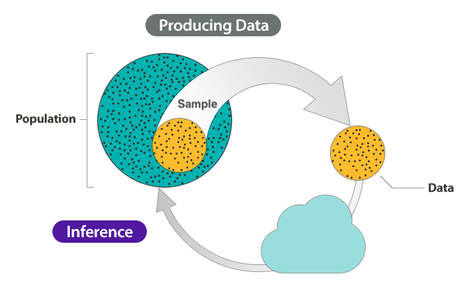
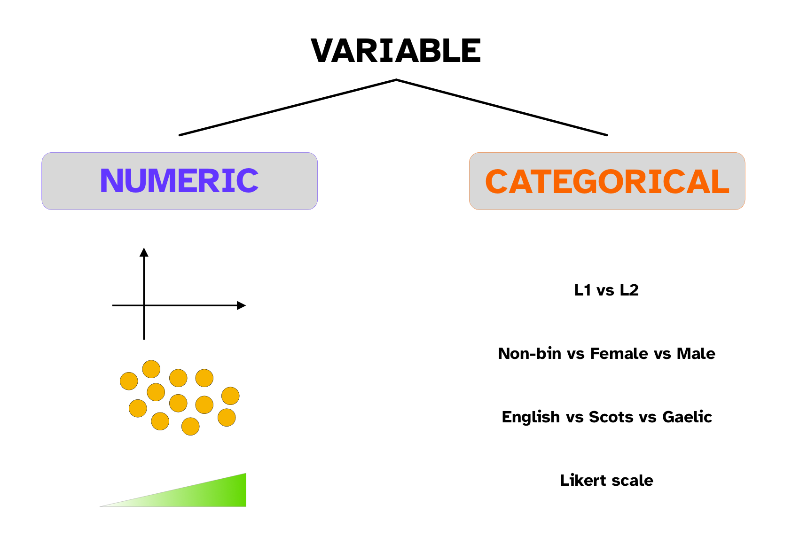
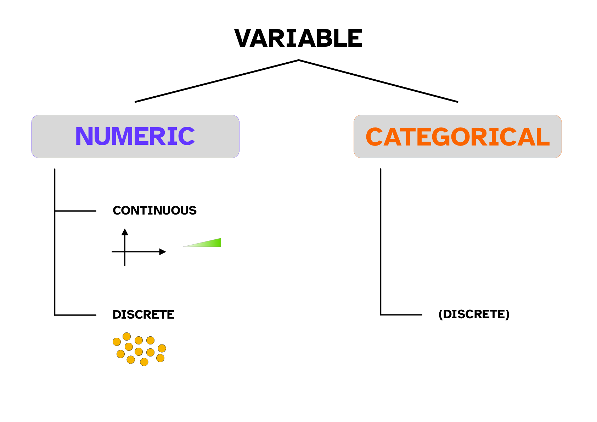
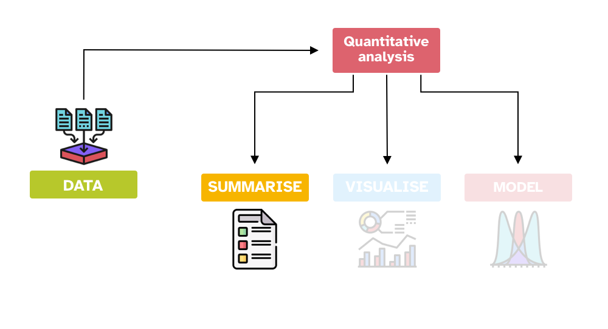
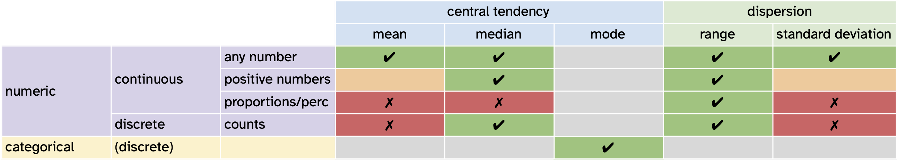

```{r setup, include=FALSE}
options(htmltools.dir.version = FALSE)
knitr::opts_chunk$set(
  fig.width=7, fig.height=5, fig.retina=3,
  out.width = "60%", fig.align = "center",
  cache = FALSE,
  echo = TRUE,
  message = FALSE, 
  warning = FALSE,
  hiline = TRUE
)
knitr::opts_knit$set(root.dir = here::here())

library(xaringanExtra)
use_xaringan_extra(c("panelset", "tachyons", "freezeframe"))

options(ggplot2.discrete.fill = RColorBrewer::brewer.pal(8, "Dark2"))
options(ggplot2.discrete.colour = RColorBrewer::brewer.pal(8, "Dark2"))
options(show.signif.stars = FALSE)

my_seed <- 8878
set.seed(my_seed)
```

class: center middle reverse

# TURN MIC ON!

---

<iframe allowfullscreen frameborder="0" height="100%" mozallowfullscreen style="min-width: 500px; min-height: 355px" src="https://app.wooclap.com/events/SQQFXB/questions/650da2afee00ec87f4ba2bb2" width="100%"></iframe>

---

<iframe allowfullscreen frameborder="0" height="100%" mozallowfullscreen style="min-width: 500px; min-height: 355px" src="https://app.wooclap.com/events/SQQFXB/questions/650e9f61e6ae38eac56ba5cc" width="100%"></iframe>

---

layout: true

## Sample $y$

---

.center[

]

When we ask a research question, we collect a sample $y$ from a population.

---

.bg-washed-blue.b--dark-blue.ba.bw2.br3.shadow-5.ph4.mt2[
$y$ is a sample of values (`\(y_1, y_2, y_3, ..., y_n\)`).
]

--

.bg-washed-green.b--dark-green.ba.bw2.br3.shadow-5.ph4.mt2[
Sample of values can be e.g.:

- Number of telic and atelic verbs in a historical corpus of Sanskrit.

- Voice Onset Time of stops from 50 speakers Mapudungun.

- Friendliness ratings of synthetic speech as indicated by 300 participants.

- ...
]

---

.bg-washed-blue.b--dark-blue.ba.bw2.br3.shadow-5.ph4.mt2[
$y$ is a sample of values (`\(y_1, y_2, y_3, ..., y_n\)`).
]

.bg-washed-green.b--dark-green.ba.bw2.br3.shadow-5.ph4.mt2[
**We say that the values in the sample $y$ were generated by a (random) variable $Y$.**
]

---

layout: false
layout: true

## Variable $Y$

---

.bg-washed-blue.b--dark-blue.ba.bw2.br3.shadow-5.ph4.mt2[
$Y$ is a (random) variable that generates the values in the sample $y$.
]

--

.bg-washed-green.b--dark-green.ba.bw2.br3.shadow-5.ph4.mt2[
**A (statistical) variable is any characteristics, number, or quantity that can be measured or counted**

- When you observe or measure something, you are taking note of the values generated by the variable.

- It's called variable because it varies (ha!).

- The opposite of a variable is a *constant*.
]

---

.bg-washed-blue.b--dark-blue.ba.bw2.br3.shadow-5.ph4.mt2[
$Y$ is a (random) variable that generates the values in the sample $y$.
]

.bg-washed-green.b--dark-green.ba.bw2.br3.shadow-5.ph4.mt2[
Variables can be e.g.:

- Token number of telic verbs and atelic verbs in written Sanskrit.

- Voice Onset Time of stops in Mapudungun.

- Friendliness ratings of synthetic speech.

- ...
]

---

layout: false
layout: true

## Types of variables

---

.center[

]

---

.center[

]

---

.bg-washed-blue.b--purple.ba.bw2.br3.shadow-5.ph4.mt1[
**Numeric continuous variable**: *between any two values there is an infinite number of values*.

- The variable can take on any positive and negative number, including 0.

- The variable can take on any positive number only.

- **Proportions** and **percentages**: The variable can take on any number between 0 and 1.
]

--

.bg-washed-blue.b--purple.ba.bw2.br3.shadow-5.ph4.mt1[
**Numeric discrete variable**: *between any two consecutive values there are no other values*.

- **Counts**: The variable can take only on any positive integer number.
]

--

.bg-washed-yellow.b--gold.ba.bw2.br3.shadow-5.ph4.mt1[
**Categorical (discrete) variable**.

- **Binary** or **dichotomous**: The variable can take only one of two values.

- The variable can take any of three of more values.

- **Ordinal**: The variable can take any of three of more values and the values have a natural order.
]


---

layout: false

## Operationalisation

.bg-washed-blue.b--dark-blue.ba.bw2.br3.shadow-5.ph4.mt2[
We can **operationalise** something as a numeric or a categorical variable.
]

--

.bg-washed-green.b--dark-green.ba.bw2.br3.shadow-5.ph4.mt2[
Think of ways to operationalise the following:

- Voice Onset Time.

- Friendliness of speech.

- Lexical frequency.

- ...
]

---

<iframe allowfullscreen frameborder="0" height="100%" mozallowfullscreen style="min-width: 500px; min-height: 355px" src="https://app.wooclap.com/events/SQQFXB/questions/65019850638677cbb76578e0" width="100%"></iframe>

---

layout: true

## Summary measures

---

.center[

]

---

.bg-washed-blue.b--dark-blue.ba.bw2.br3.shadow-5.ph4.mt2[
We can summarise variables using **summary measures**.
]

--

.bg-washed-green.b--dark-green.ba.bw2.br3.shadow-5.ph4.mt2[

There are two types of summary measures.

**Measures of central tendency**

- Measures of central tendency indicate the **typical or central value** of a sample. 

**Measures of dispersion**

- Measures of dispersion indicate the **spread or dispersion** of the sample values around the central tendency value.
]

--

.bg-washed-yellow.b--gold.ba.bw2.br3.shadow-5.ph4.mt2[
**Always report a measure of central tendency together with its measure of dispersion!**
]

---

layout: false

## Measures of central tendency

.bg-washed-green.b--dark-green.ba.bw2.br3.shadow-5.ph4.mt2[
**Mean**

$$\bar{x} = \frac{\sum_{i=1}^{n} x_i}{n} = \frac{x_1 + ... + x_n}{n}$$
]

--

.bg-washed-green.b--dark-green.ba.bw2.br3.shadow-5.ph4.mt2[
**Median**

$$\text{if } n \text{ is odd, } x_\frac{n+1}{2}$$

$$\text{if } n \text{ is even,  } \frac{x_\frac{n}{2} + x_\frac{n}{2}}{2}$$
]

--

.bg-washed-green.b--dark-green.ba.bw2.br3.shadow-5.ph4.mt2[
**Mode**

The most common value.
]

---

## Measures of dispersion

.bg-washed-green.b--dark-green.ba.bw2.br3.shadow-5.ph4.mt2[
**Minimum and maximum** values
]

--

.bg-washed-green.b--dark-green.ba.bw2.br3.shadow-5.ph4.mt2[
**Range**

$$ max(x) - min(x)$$

The difference between the largest and smallest value.

]

--

.bg-washed-green.b--dark-green.ba.bw2.br3.shadow-5.ph4.mt2[
**Standard deviation**

$$\text{SD} = \sqrt{\frac{\sum_{i=1}^n (x_i - \bar{x})^2}{n-1}} = \sqrt{\frac{(x_1 - \bar{x})^2 + ... + (x_n - \bar{x})^2}{n-1}}$$
]


---

## Mean

Use the mean with **numeric continuous variables**, if:

- The variable can take on any positive and negative number, including 0.

```{r mean-1}
mean(c(-1.12, 0.95, 0.41, -2.1, 0.09))
```

- The variable can take on any positive number only.

```{r mean-2}
mean(c(0.32, 2.58, 1.5, 0.12, 1.09))
```

--

.bg-washed-yellow.b--gold.ba.bw2.br3.shadow-5.ph4.mt1[
**Don't take the mean of proportions and percentages!**

Better to calculate the proportion/percentage across the entire data, rather than take the mean of individual proportions/percentages: see [this blog post](https://www.robertoreif.com/blog/2018/1/7/why-you-should-be-careful-when-averaging-percentages). If you really really have to, use the *median*.
]

---

layout: true

## Median

---

Use the median with **numeric (continuous and discrete) variables**.

```{r median-1}
median(c(-1.12, 0.95, 0.41, -2.1, 0.09))
sort(c(-1.12, 0.95, 0.41, -2.1, 0.09))
median(c(0.32, 2.58, 1.5, 0.12, 1.09))
sort(c(0.32, 2.58, 1.5, 0.12, 1.09))
```

---

```{r median-2}
median(c(4, 6, 3, 9, 7, 15))
sort(c(4, 6, 3, 9, 7, 15))
```

---

```{r median-3}
median(c(4, 6, 3, 9, 7, 15))
mean(c(4, 6, 3, 9, 7, 15))
median(c(4, 6, 3, 9, 7, 40))
mean(c(4, 6, 3, 9, 7, 40))
```

---

.bg-washed-yellow.b--gold.ba.bw2.br3.shadow-5.ph4.mt1[
- **The mean is very sensitive to outliers.**

- The median is **not**.
]

---

layout: false

## Mode

Use the mode with **categorical (discrete) variables**.

```{r mode}
table(c("red", "red", "blue", "yellow", "blue", "green", "red", "yellow"))
```

The mode is the most frequent value: `red`.

--

.bg-washed-yellow.b--gold.ba.bw2.br3.shadow-5.ph4.mt1[
**Likert scales are ordinal (categorical) variables, so the mean and median are not appropriate!**

You should use the mode (You can use the median with Likert scales if you really really need to...)
]

---

## Minimum and maximum

Report minimum and maximum values for any **numeric variable**.

```{r min-max}
x_1 <- c(-1.12, 0.95, 0.41, -2.1, 0.09)

min(x_1)
max(x_1)
range(x_1)
```


---

## Range

Use the range with any **numeric variable**.

```{r range}
x_1 <- c(-1.12, 0.95, 0.41, -2.1, 0.09)
max(x_1) - min(x_1)

x_2 <- c(0.32, 2.58, 1.5, 0.12, 1.09)
max(x_2) - min(x_2)

x_3 <- c(4, 6, 3, 9, 7, 15)
max(x_3) - min(x_3)
```

---

## Standard deviation

Use the standard deviation with **numeric continuous variables**, if:

- The variable can take on any positive and negative number, including 0.

```{r sd-1}
sd(c(-1.12, 0.95, 0.41, -2.1, 0.09))
```

- The variable can take on any positive number only.

```{r sd-2}
sd(c(0.32, 2.58, 1.5, 0.12, 1.09))
```

--

.bg-washed-blue.b--dark-blue.ba.bw2.br3.shadow-5.ph4.mt1[
Standard deviations are **relative** and depend on the measurement **unit/scale!**
]

--

.bg-washed-yellow.b--gold.ba.bw2.br3.shadow-5.ph4.mt1[
**Don't use the standard deviation with proportions and percentages!**

]

---

<iframe allowfullscreen frameborder="0" height="100%" mozallowfullscreen style="min-width: 500px; min-height: 355px" src="https://app.wooclap.com/events/SQQFXB/questions/65019d638c8a6cf328483110" width="100%"></iframe>

---

## Summary measures overview

<br>
<br>
<br>

.center[

]

---

## Summary

.bg-washed-blue.b--dark-blue.ba.bw2.br3.shadow-5.ph4.mt2[
- The **sample** $y$ is generated by a (random) variable $Y$.

- A (statistical) **variable** is any characteristics, number, or quantity that can be measured or counted.

- Variables can be **numeric or categorical**.

  - Numeric variables can be continuous or discrete.
  - Categorical variables are only discrete.
  
- We **operationalise** a measure/observation as a numeric or a categorical variable.

- We summarise variables using **summary measures**:

  - Measures of **central tendency** indicate the typical or central value of a sample.
  - Measures of **dispersion indicate** the spread or dispersion of the sample values around the central tendency value.
]
