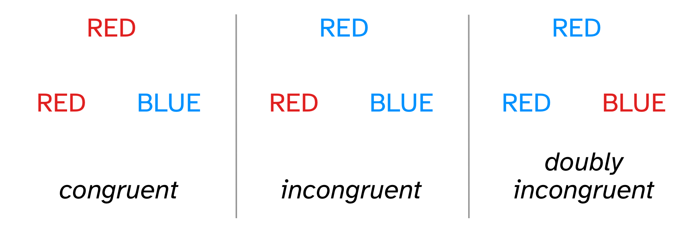

```{r setup, include=FALSE}
options(htmltools.dir.version = FALSE)
knitr::opts_chunk$set(
  fig.width=7, fig.height=5, fig.retina=3,
  out.width = "60%", fig.align = "center",
  cache = FALSE,
  echo = FALSE,
  message = FALSE, 
  warning = FALSE,
  hiline = TRUE
)
knitr::opts_knit$set(root.dir = here::here())

library(xaringanExtra)
use_xaringan_extra(c("panelset", "tachyons", "freezeframe"))

library(tidyverse)
theme_set(theme_light())
library(brms)
library(extraDistr)
library(ggdist)
library(glue)
library(posterior)

theme_update(text = element_text(size=14))

options(ggplot2.discrete.fill = RColorBrewer::brewer.pal(8, "Dark2"))
options(ggplot2.discrete.colour = RColorBrewer::brewer.pal(8, "Dark2"))
options(show.signif.stars = FALSE)
my_seed <- 8878
set.seed(my_seed)
```


---

## The Stroop effect

> The Stroop effect [is] a **slowing of reaction times when asked to name the color of a word that denotes a different color** (e.g., the word “red” written in green letters) as compared to when the color and denotation of a word are the same (e.g., the word “red” written in red letters), [and] reflects behavioral inhibition.

—From [Cannabinoids in Neurologic and Mental Disease, 2015](https://www.sciencedirect.com/science/article/pii/B978012417041400014X)

--

<br>

.pull-left[
.f1.center.red[RED]

.f1.center[*congruent*]
]

.pull-right[
.f1.center.blue[RED]

.f1.center[*incongruent*]
]

---

## "Double trouble" variant

<br>


.center[

]

---

## L1 vs L2 English speakers and language proficiency

---

<iframe allowfullscreen frameborder="0" height="100%" mozallowfullscreen style="min-width: 500px; min-height: 355px" src="https://app.wooclap.com/events/SQQFXB/questions/6554f9e630f3da97e1e0db33" width="100%"></iframe>

---

## Literature review


---

<iframe allowfullscreen frameborder="0" height="100%" mozallowfullscreen style="min-width: 500px; min-height: 355px" src="https://app.wooclap.com/events/SQQFXB/questions/6554f9ea30f3da97e1e0dc23" width="100%"></iframe>
