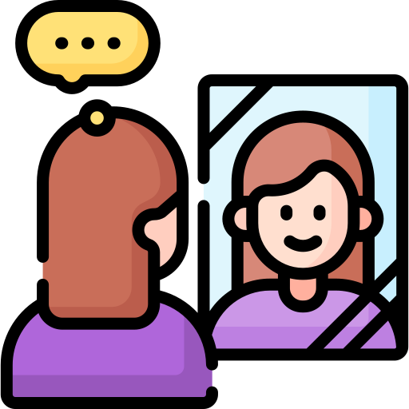

## Welcome to QML!

## Who am I?

::: callout-note
## Practicalities

- Who am I?

- Overview and week-by-week contents: <https://uoelel.github.io/qml/content.html>

- Assessment: <https://uoelel.github.io/qml/assessments.html>

  - **Weekly self-reflections** in the Reflective Journal (on Learn): DUE EVERY WEEK by the following Wednesday.

  - Information: <https://uoelel.github.io/qml/assessments.html#reflective-journal>

- This is a **very intense course!**

  - We focus on quantitative methods for knowledge-oriented research. No machine learning, LLMs, language technology.

- Finding help:

  - Office Hours.

  - Piazza: Q&A forum.
:::

## Overview

## Assessment

::::::::::::::::::: columns
:::::::::: column
::::::::: callout-tip
### Formative assessments

::::: columns
::: column
{width="150"}
:::

::: column
4 self-reflections
:::
:::::

::::: columns
::: column
{width="150"}
:::

::: column
2 quizzes
:::
:::::
:::::::::
::::::::::

:::::::::: column
::::::::: callout-tip
### Summative assessments

::::: columns
::: column
{width="150"}
:::

::: column
Final Self-reflection
:::
:::::

::::: columns
::: column
{width="150"}
:::

::: column
Group project
:::
:::::
:::::::::
::::::::::
:::::::::::::::::::

Detailed information on assessment can be found here: <https://uoelel.github.io/qml/assessments.html>

:::: aside
::: {style="font-size: 8pt;"}
<a href="https://www.flaticon.com/free-icons/self-esteem" title="self esteem icons">Self esteem icons created by Freepik - Flaticon</a> <a href="https://www.flaticon.com/free-icons/analysis" title="analysis icons">Analysis icons created by HAJICON - Flaticon</a>
:::
::::

## Finding help
