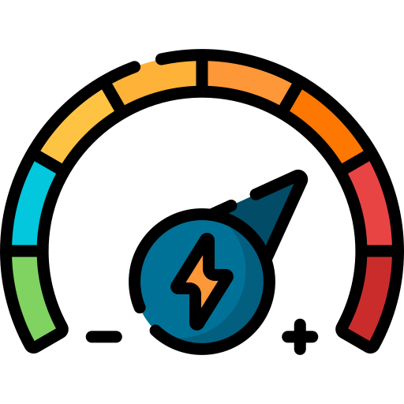
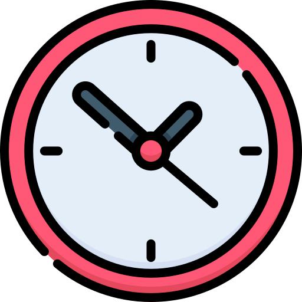

## Welcome to QML! {.center background-color="var(--inverse)"}

## Who am I?

::::::: columns
::: column
{height="500" fig-align="center"}
:::

::::: column
::: {.callout-note appearance="simple"}
- Dr Stefano \[ˈsteˑfano\] Coretta

- Lecturer (= Assistant Professor) in LEL.

- Methodological theory and statistics in linguistics.
:::

::: {.fragment .callout-tip}
## My researcher orientation

Read it [here](https://stefanocoretta.github.io/orientation.html).
:::
:::::
:::::::

## Overview

<br>

::::::: columns
:::: column
{fig-align="center" width="150"}

::: {style="text-align: center;"}
[very **intense** course]{.t2em}
:::
::::

:::: {.column .fragment}
{fig-align="center" width="150"}

::: {style="text-align: center;"}
[knowledge-oriented research]{.t2em}
:::
::::
:::::::

::: aside
[<a href="https://www.flaticon.com/free-icons/intensity" title="intensity icons">Intensity icons created by Freepik - Flaticon</a> <a href="https://www.flaticon.com/free-icons/knowledge" title="knowledge icons">Knowledge icons created by Freepik - Flaticon</a>]{style="font-size: 8pt;"}
:::

## Course website

<br><br>

[[uoelel.github.io/qml/](https://uoelel.github.io/qml/)]{.r-fit-text}

. . .

See the [Content](https://uoelel.github.io/qml/content.html) page for a week-by-week breakdown.

. . .

Also see Learn.

## Assessment

::::::::::::::::::::: columns
::::::::::: column
:::::::::: callout-tip
### Formative assessments

::::::::: fragment
::::: columns
::: {.column width="30%"}
{fig-align="center" width="100"}
:::

::: {.column width="70%"}
<br><br> [4 Self-reflections]{style="font-size: 1.5em;"}
:::
:::::

::::: columns
::: {.column width="30%"}
{fig-align="center" width="100"}
:::

::: {.column width="70%"}
<br><br> [2 Quizzes]{style="font-size: 1.5em;"}
:::
:::::
:::::::::
::::::::::
:::::::::::

::::::::::: column
:::::::::: callout-note
### Summative assessments

::::::::: fragment
::::: columns
::: {.column width="30%"}
{fig-align="center" width="100"}
:::

::: {.column width="70%"}
<br><br> [Final Self-reflection]{style="font-size: 1.5em;"}
:::
:::::

::::: columns
::: {.column width="30%"}
{fig-align="center" width="100"}
:::

::: {.column width="70%"}
<br><br> [Group Project]{style="font-size: 1.5em;"}
:::
:::::
:::::::::
::::::::::
:::::::::::
:::::::::::::::::::::

. . .

Detailed information on assessment can be found here: <https://uoelel.github.io/qml/assessments.html>

:::: aside
::: {style="font-size: 8pt;"}
<a href="https://www.flaticon.com/free-icons/self-esteem" title="self esteem icons">Self esteem icons created by Freepik - Flaticon</a> <a href="https://www.flaticon.com/free-icons/analysis" title="analysis icons">Analysis icons created by HAJICON - Flaticon</a>
:::
::::

## Changes

:::: callout-note
## Last year's feedback

::: incremental
- Pace of the course: too slow AND too fast
  - No real solution... BUT change of pace between Week 4 and 5.
- Lecture content is variable
  - Now readings must be completed before each lecture.
- Group project: too many formats
  - Data analysis is the only format.
:::
::::

## Finding help

<br>

::::::: columns
:::: column
{fig-align="center" width="150"}

::: {style="text-align: center;"}
[[book](https://outlook.office.com/book/Stefanosofficehours@uoe.onmicrosoft.com/?ismsaljsauthenabled) office hours]{.t15em}

\[link also on the course homepage\]
:::
::::

:::: {.column .fragment}
{fig-align="center" width="150"}

::: {style="text-align: center;"}
[Piazza Q&A forum]{.t15em}

\[access via Learn\]
:::
::::
:::::::

::: aside
[<a href="https://www.flaticon.com/free-icons/clock" title="clock icons">Clock icons created by Freepik - Flaticon</a> <a href="https://www.flaticon.com/free-icons/forum" title="forum icons">Forum icons created by Freepik - Flaticon</a>]{style="font-size: 8pt;"}
:::

## 

```{=html}
<iframe allowfullscreen frameborder="0" height="80%" mozallowfullscreen style="min-width: 500px; min-height: 355px" src="https://app.wooclap.com/events/RRYQTLH/questions/6a27e65cb5cb1178d5b6a61b" width="100%"></iframe>
```

## Group activity

::::: columns
::: {.column width="70%"}
[{fig-align="center" width="600"}](https://forms.office.com/e/2NFcCVdtfL)
:::

::: {.column width="30%"}
```{=html}
<iframe style="width:100%;max-width:360px;height:360px;" src="https://stopwatch-app.com/widget/timer?theme=light&color=indigo&hrs=0&min=10&sec=0" frameborder="0"></iframe>
```
:::
:::::
