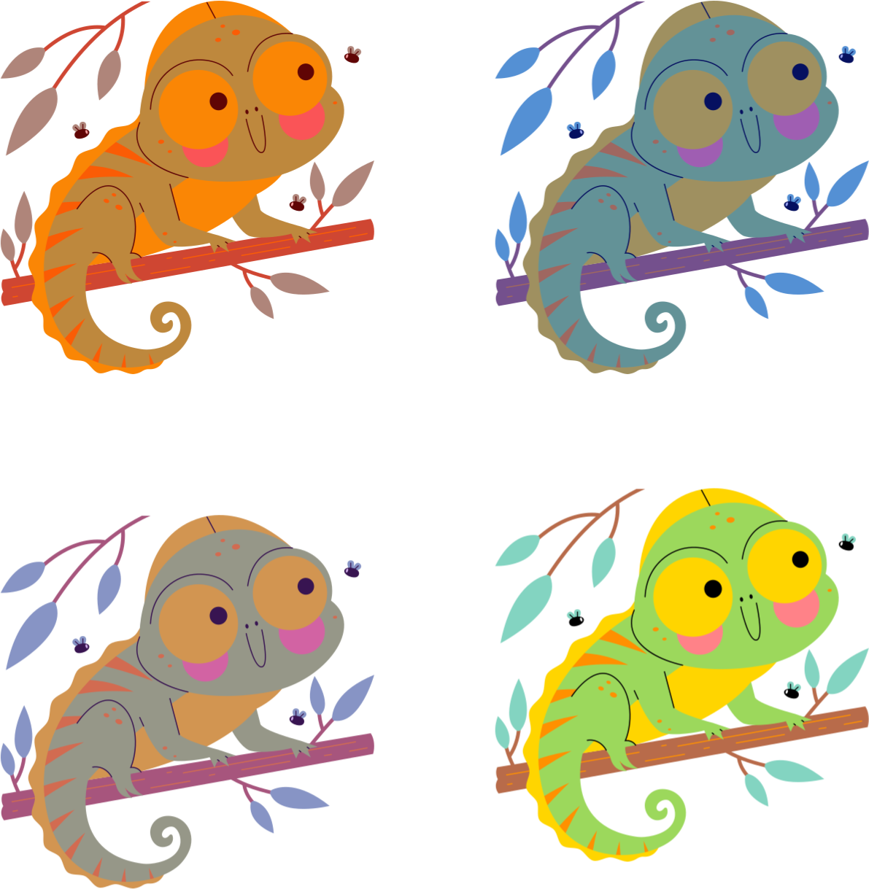

## Inference

{fig-align="center"}

## Bilingual advantage: myth or reality?

:::::: columns
:::: column
::: {.callout-tip appearance="simple"}
**Bilingual advantage hypothesis**

Bilingual individuals possess a cognitive advantage over monolinguals due to greater cognitive control implied in using more than one language.
[@poarch2019; @samuel2018]
:::
::::

::: column
{fig-align="center" width="400px"}
:::
::::::

::: aside
[<a href="https://www.flaticon.com/free-icons/bilingual" title="bilingual icons">Bilingual icons created by Freepik - Flaticon</a>]{style="font-size: 8px;"}
:::

## Bilingual advantage: inconclusive!

::::::: columns
::::: column
::: {.callout-tip appearance="simple"}
Research **both for and against** the bilingual advantage hypothesis.
[@franck2024; @garraffa2023].
:::

<br>

::: {.fragment .callout-important appearance="simple"}
Inconclusive does *not* mean "there is no bilingual advantage".
:::
:::::

::: column
{fig-align="center" width="400px"}
:::
:::::::

::: aside
[<a href="https://www.flaticon.com/free-icons/doubt" title="doubt icons">Doubt icons created by Freepik - Flaticon</a>]{style="font-size: 8px;"}
:::

## Group activity

:::::: columns
:::: {.column width="75%"}
::: callout-note
### Instructions

- Discuss reasons for which research on the bilingual advantage is inconclusive.

- You'll share what you discussed in a Wooclap poll in the next slide.
:::
::::

::: {.column width="25%"}
```{=html}
<iframe style="width:100%;max-width:360px;height:360px;"
                    src="https://stopwatch-app.com/widget/timer?theme=light&color=indigo&hrs=0&min=5&sec=0" 
                    frameborder="0"></iframe>
```
:::
::::::

## Share your thoughts

```{=html}
<iframe allowfullscreen frameborder="0" height="80%" mozallowfullscreen style="min-width: 500px; min-height: 355px" src="https://app.wooclap.com/events/EIZPEY/questions/68a5b4cbff22a5075a3dd52a" width="100%"></iframe>
```

## Uncertainty and variability

::::::: columns
:::: column
{fig-align="center" height="300px"}

::: {.callout-note appearance="simple"}
**Uncertainty**

is a characteristic of each observation of a phenomenon, due to measurement error or because we cannot directly measure what we want to measure.
:::
::::

:::: {.fragment .column}
{fig-align="center" height="300px"}

::: {.callout-note appearance="simple"}
**Variability**

is found among different observations of the same phenomenon, due to natural fluctuations and measurement error.
:::
::::
:::::::

::: aside
[Images by [Stickers](https://www.flaticon.com/authors/stickers).]{style="font-size: 8px;"}
:::

## Group activity

:::::: columns
:::: {.column width="75%"}
::: callout-note
### Instructions

- Each group will get a research card with a short literature review and a small data set.

- Answer the following question:

  > Are younger infants better at discriminating non-native phonetic contrasts than older infants?
:::
::::

::: {.column width="25%"}
```{=html}
<iframe style="width:100%;max-width:360px;height:360px;"
                    src="https://stopwatch-app.com/widget/timer?theme=light&color=indigo&hrs=0&min=15&sec=0" 
                    frameborder="0"></iframe>
```
:::
::::::

## Share your answer

```{=html}
<iframe allowfullscreen frameborder="0" height="80%" mozallowfullscreen style="min-width: 500px; min-height: 355px" src="https://app.wooclap.com/events/EIZPEY/questions/68d123d6796e2e8c31715b44" width="100%"></iframe>
```

## Many analysts, one data set

::: {.callout-note appearance="simple"}
- You just experienced a form of "many analysts, one data set" scenario.

- @coretta2023 asked 30 teams to answer the same research question with the same data.

  > Do speakers acoustically modify utterances to signal atypical word combinations?

  - Participants had to instruct a confederate to move a cube on top of an object. The object either had a typical or atypical colour: YELLOW vs BLUE banana.

- We gave the data to all teams and they sent us back:

  - **109 individual analyses**—a bit more than 3 analyses per team!
  - **Nine teams out of the thirty (30%) reported to have found at least one statistically reliable effect.**
:::

## Many analysts, one data set

{fig-align="center"}

## References
