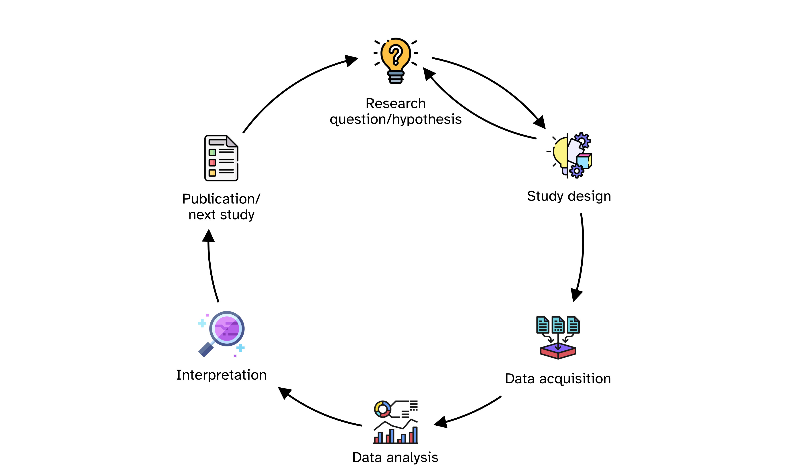
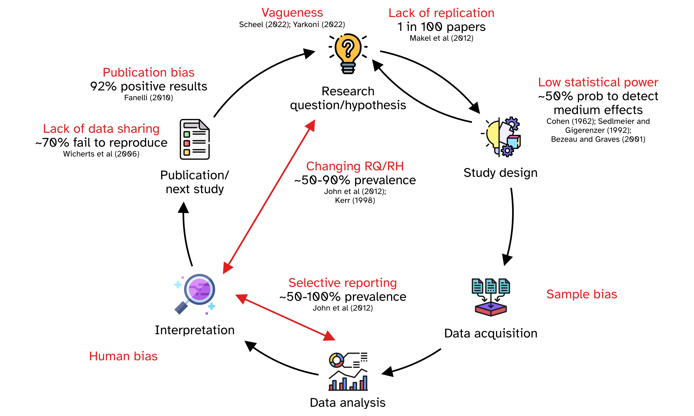
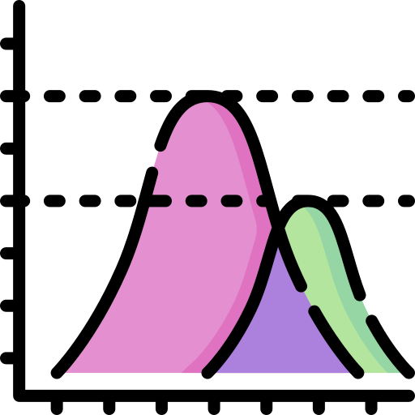
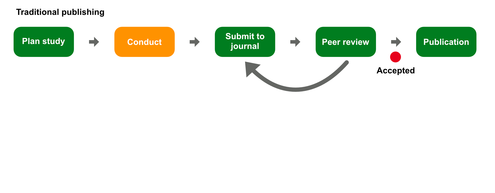
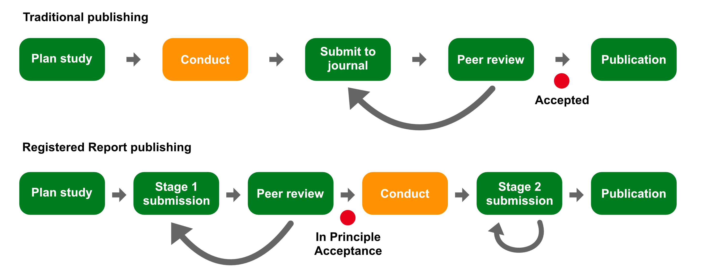

## The Research Cycle

{fig-align="center" width="700"}

## Questionable Research Practices (QRPs)

{fig-align="center" width="700"}

## Group activity

:::::: columns
:::: {.column width="75%"}
::: callout-note
### Instructions

Discuss the following practices: are they questionable?
Why?

1.  A researcher tests several different statistical models on the same dataset but only reports the one that gives the strongest effect.

2.  A researcher preregisters their study design, runs the study as planned, and publishes the results even though they found no effect.

3.  After running an experiment, a researcher changes the stated hypothesis to match the observed results and rewrites the paper introduction.

4.  A research team decides to increase their sample size mid-study because they realise the initial sample lacks the statistical power to detect medium effects.
    They clearly document this change in their published article.

5.  An author declines to share their raw data when requested by other researchers, without offering any clear reason (e.g. confidentiality, ethical restrictions).
:::
::::

::: {.column width="25%"}
```{=html}
<iframe style="width:100%;max-width:360px;height:360px;"
                    src="https://stopwatch-app.com/widget/timer?theme=light&color=indigo&hrs=0&min=5&sec=0" 
                    frameborder="0"></iframe>
```
:::
::::::

## Share your thoughts

```{=html}
<iframe allowfullscreen frameborder="0" height="80%" mozallowfullscreen style="min-width: 500px; min-height: 355px" src="https://app.wooclap.com/events/EIZPEY/questions/68aaed39cc0a8cceadd9a1f8" width="100%"></iframe>
```

## Group activity

:::::: columns
:::: {.column width="75%"}
::: callout-note
### Instructions

- Go to <https://stefanocoretta.github.io/qrp/>.

- **Play the game three times** to publish three papers: the goal is to publish all three!

- You need to balance Integrity and Career points and beat the reviewers lottery.
:::
::::

::: {.column width="25%"}
```{=html}
<iframe style="width:100%;max-width:360px;height:360px;"
                    src="https://stopwatch-app.com/widget/timer?theme=light&color=indigo&hrs=0&min=10&sec=0" 
                    frameborder="0"></iframe>
```
:::
::::::

## Share your final paper count

```{=html}
<iframe allowfullscreen frameborder="0" height="80%" mozallowfullscreen style="min-width: 500px; min-height: 355px" src="https://app.wooclap.com/events/EIZPEY/questions/68aaeef3159e7d9874e6a17e" width="100%"></iframe>
```

## Peer-review for better or worse?

::::::::::: {style="font-size: 0.7em;"}
:::::: columns
::: {.fragment .column width="33%"}
{fig-align="center" width="100px"}

Little empirical evidence that peer review ensures quality.
:::

::: {.fragment .column width="33%"}
{fig-align="center" width="100px"}

Changes to manuscript contents are limited.
:::

::: {.fragment .column width="33%"}
{fig-align="center" width="100px"}

Statistical content increases after review.
:::
::::::

:::::: columns
::: {.fragment .column width="33%"}
{fig-align="center" width="100px"}

Training reviewers does not improve manuscript.
:::

::: {.fragment .column width="33%"}
{fig-align="center" width="100px"}

Most suggestions are ignored when re-submitting to a different journal.
:::

::: {.column width="33%"}
:::
::::::
:::::::::::

::: aside
@smith2006; @white2003; @jefferson2002; @jefferson2007; @bruce2016; @garciacosta2022; @stephen2022

[<a href="https://www.flaticon.com/free-icons/quality-assurance" title="quality assurance icons">Quality assurance icons created by Slamlabs - Flaticon</a>. <a href="https://www.flaticon.com/free-icons/register" title="register icons">Register icons created by Pixel perfect - Flaticon</a>. <a href="https://www.flaticon.com/free-icons/statistics" title="statistics icons">Statistics icons created by Freepik - Flaticon</a>. <a href="https://www.flaticon.com/free-icons/practice" title="practice icons">Practice icons created by Elzicon - Flaticon</a>. <a href="https://www.flaticon.com/free-icons/cancel" title="cancel icons">Cancel icons created by Freepik - Flaticon</a>]{style="font-size: 8px;"}
:::

## Registered Reports

{fig-align="center"}

## Registered Reports

{fig-align="center"}

## References
