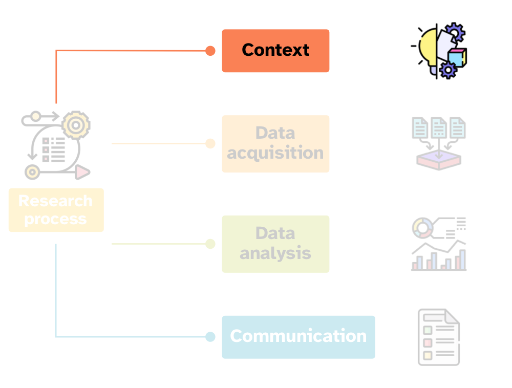
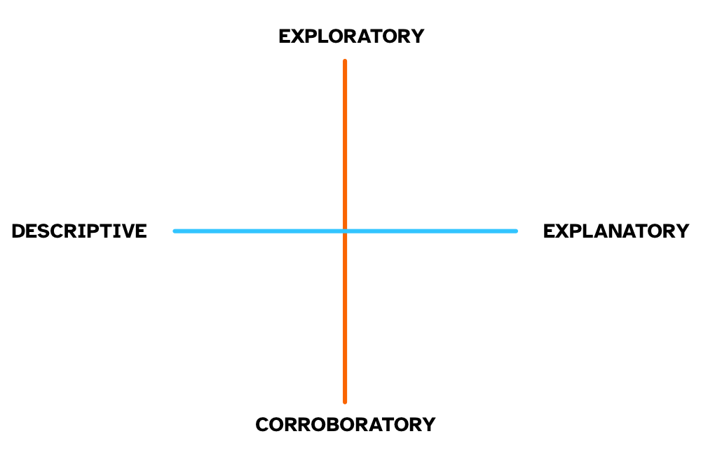
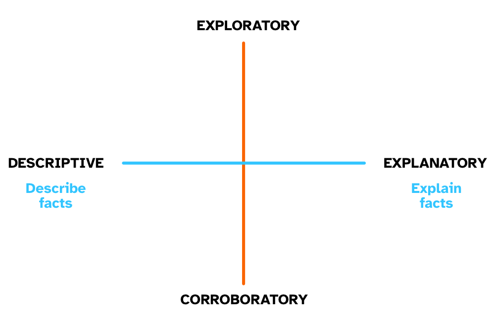
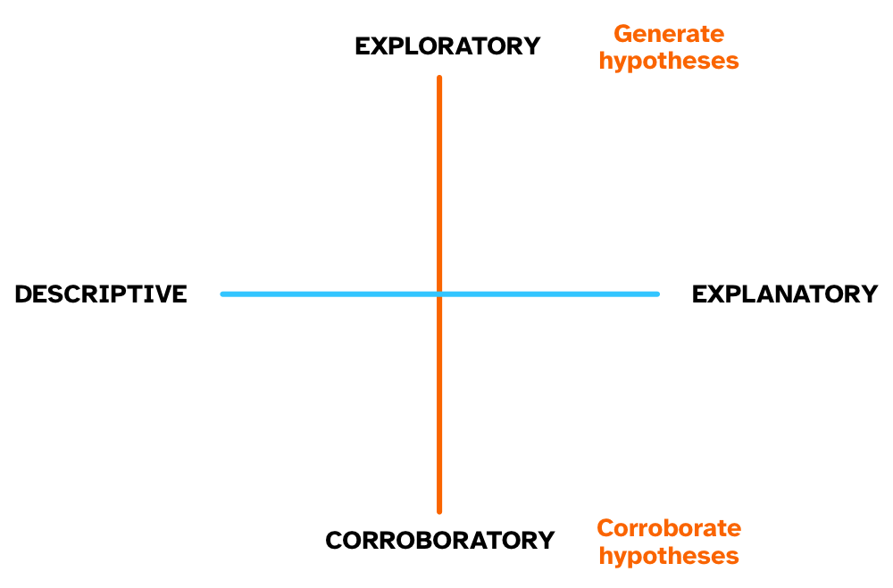
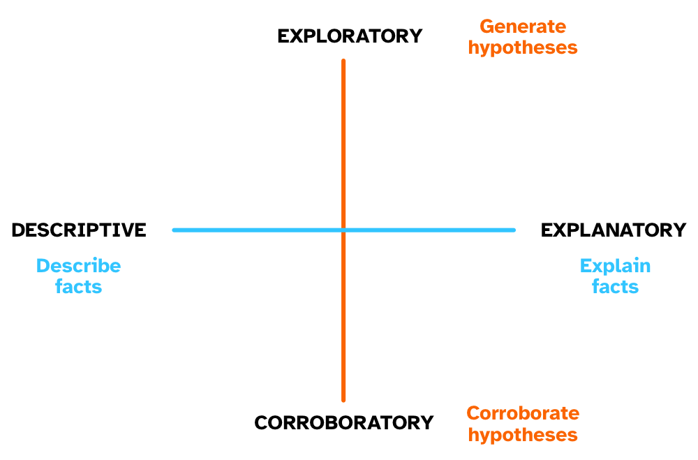
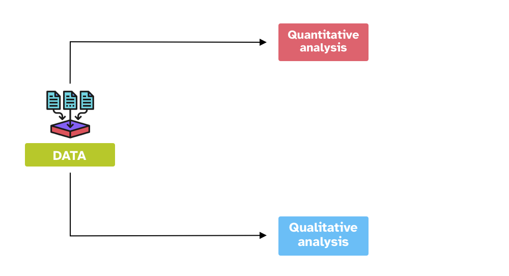

```{r setup, include=FALSE}
options(htmltools.dir.version = FALSE)
knitr::opts_chunk$set(
  fig.width=7, fig.height=5, fig.retina=3,
  out.width = "60%", fig.align = "center",
  cache = FALSE,
  echo = TRUE,
  message = FALSE, 
  warning = FALSE,
  hiline = TRUE
)
knitr::opts_knit$set(root.dir = here::here())

library(xaringanExtra)
use_xaringan_extra(c("panelset", "tachyons", "freezeframe"))

options(ggplot2.discrete.fill = RColorBrewer::brewer.pal(8, "Dark2"))
options(ggplot2.discrete.colour = RColorBrewer::brewer.pal(8, "Dark2"))
options(show.signif.stars = FALSE)
```

```{r xaringan-themer, include=FALSE, warning=FALSE}
library(xaringanthemer)
style_mono_light(outfile = "slides/xaringan-themer.css")
```

## Before we begin...

.pull-left[
.f3[Complete the **SATS-36 questionnaire**.]

.f3[https://www.soscisurvey.de/sqmb-sats/]
]

.pull-right[
.center[

]
]


---

layout: true

## Course info

---

- The main course website <https://uoelel.github.io/qml/>.

- Course announcements are sent via Learn.

- **ASK FOR HELP**: It is OK not to be OK, and remember that you are not alone.

  - Go to the PPLS UG or PG Hub (on SharePoint Online) > Support for students > Wellbeing and Health.
  - Come to my office hours (booking link on Learn).

- Assessment:

  - **Formative assessments**: Two formative assessments due on Thursdays.
  - **Summative assessments**: Two summative assessments (50-50).

---

**News**

- **QML (Quantitative Methods for Linguistics and English)** is an updated version of previous year's SQM courses.

- The main learning objective of this course is to allow you to **conduct basic data analyses** which can be applied to linguistic questions and data.

- We will focus on **modern techniques** of data handling and quantitative analysis.

---

**Student Reps**

- Two student reps (one should be EDI rep).

- Two meetings with CO on Week 3 and Week 7.

- Collect feedback/suggestions from students.

---

layout: false
class: middle

.pull-left[

]

.pull-right[
.f3[For, you see, so many out-of-the-way things had happened lately, that Alice had begun to think that very few things indeed were really impossible.]

.right[—Lewis C. Carol, Alice's Adventures in Wonderland ]
]

???

"If I had a world of my own, everything would be nonsense. Nothing would be what it is, because everything would be what it isn't. And contrary wise, what is, it wouldn't be. And what it wouldn't be, it would. You see?"

.right[—Alice, from Disney's *Alice in Wonderland*]

---

## Research methods

.center[

]

---

layout: true

## Research process

---

.center[

]

---

.center[

]


---

.bg-washed-blue.b--dark-blue.ba.bw2.br3.shadow-5.ph4.mt2[
**Empirical research**

- **Empirical** = data

- Learning about the Universe through data and observation.
]

--

.bg-washed-green.b--dark-green.ba.bw2.br3.shadow-5.ph4.mt2[
Find out about the etymology of *empirical*!
]

--

.bg-washed-blue.b--dark-blue.ba.bw2.br3.shadow-5.ph4.mt2[
**The two axes of reseach type**

- Exploratory vs corroboratoy.

- Descriptive vs explanatory.

]

---

.center[

]

---

.center[

]

---

.center[

]

---

.center[

]

---

.bg-washed-blue.b--dark-blue.ba.bw2.br3.shadow-5.ph4.mt2[
**Three types of research objectives**
]

--

.bg-washed-green.b--dark-green.ba.bw2.br3.shadow-5.ph4.mt2[
**Establish facts** (being agnostic)

- Fill a gap in knowledge.
- Accumulate evidence.
]

--

.bg-washed-green.b--dark-green.ba.bw2.br3.shadow-5.ph4.mt2[
**Improve fit of framework to facts**
]

--

.bg-washed-green.b--dark-green.ba.bw2.br3.shadow-5.ph4.mt2[
**Compare fit of different frameworks to facts**
]

---

.bg-washed-blue.b--dark-blue.ba.bw2.br3.shadow-5.ph4.mt2[
**Three types of research objectives** (examples)
]

.bg-washed-green.b--dark-green.ba.bw2.br3.shadow-5.ph4.mt2[
**Establish facts** (being agnostic)

- What are the uses of the Sanskrit verb *gam* 'to go'.
]

.bg-washed-green.b--dark-green.ba.bw2.br3.shadow-5.ph4.mt2[
**Improve fit of framework to facts**

- Strong exemplar-based models preclude the possibility of abstract representations, but certain categorisation tasks seem to involve abstract representations so these must be included in exemplar-based models.
]

.bg-washed-green.b--dark-green.ba.bw2.br3.shadow-5.ph4.mt2[
**Compare fit of different frameworks to facts**

- There are two possible models for the bilingual lexicon: Word association and concept mediation. Which one better describes and explains the data?
]

---

.center[

]

---

layour: false
layout: true

## Data analysis

---

.center[

]

---

.center[

]

---

layout: false
class: inverse right middle


.f2[The numbers have no way of speaking for themselves. We speak for them. We imbue them with meaning.]

— Nate Silver, *The Signal and the Noise*

---

## Inference process

.center[

]

???

Imbuing numbers with meaning is a good characterisation of the "inference process".

We have a question about something.

Let's imagine that this something is the population of British Sign Language signers.

We want to know whether the cultural background of the BSL signers is linked to different pragmatic uses of the sign for BROTHER.

But we can't survey the entire population of BSL signers.

NOTE: *Population* can be a set of anything, not just a specific group of people. For example, the words in a dictionary can be a "population"; or the antipassive constructions of Austronesian languages; or ...

---

## Inference process

.center[

]

???

We take a **sample** from the population.

This is our empirical data (the product of observation).

How do we go from data/observation to answering our question?

We can use **inference**.

**Inference** is the process of understanding something about a population based on the sample (aka the data) taken from that population.

---

class: middle center inverse

## Inference is not infallible

???

However, inference based on data does not guarantee that the answers to our questions are right/true.

In fact, any observation we make comes with a degree of **uncertainty and variability**.

EXTRA: Check out this article: <https://www.scientificamerican.com/article/if-you-say-science-is-right-youre-wrong/>

EXTRA: Find out about Popper's view of falsification and fallibilism.

---

## Uncertainty and variability

.center[

]

???

So we have to deal with:

- Uncertainty in any observation of a phenomenon.

- Variability among different observations of the same phenomenon.

---

class: center, middle, inverse


???

Guess what it is...

---

class: center middle inverse

# *Statistics* as a tool to deal with *uncertainty* and *variability*

???

Statistics helps us quantifying uncertainty and controlling for variability.

---

class: middle

.pull-left[
# What is statistics?
]

.pull-right[


]

???

EXTRA: Check out the etymology of *statistics* here: <https://en.wiktionary.org/wiki/statistics#Etymology_1>.

Photo by <a href="https://unsplash.com/@charlesdeluvio?utm_source=unsplash&utm_medium=referral&utm_content=creditCopyText">Charles Deluvio</a> on <a href="https://unsplash.com/s/photos/dog?utm_source=unsplash&utm_medium=referral&utm_content=creditCopyText">Unsplash</a>

---

## What is statistics?

.f3[
- Statistics is the **science** concerned with developing and studying methods for collecting, analyzing, interpreting and presenting empirical data. (From [UCI Department of Statistics](https://www.stat.uci.edu/what-is-statistics/))
]

--

.f3[
- Statistics is the **technology** of extracting information, illumination and understanding from data, often in the face of uncertainty. (From the [British Academy](https://www.thebritishacademy.ac.uk/blog/what-is-statistics/))
]

--

.f3[
- Statistics is a **mathematical and conceptual** discipline that focuses on the relation between data and hypotheses. (From the [Standford Encyclopedia of Philosophy](https://plato.stanford.edu/entries/statistics/))
]

--

.f3[
- Statistics as the **art** of applying the science of scientific methods. (From [ORI Results](https://www.oriresults.com/articles/blog-posts/the-art-of-statistics/), [Nature](https://www.nature.com/articles/d41586-019-00898-0))
]

---

class: inverse right middle

.f2[*Statistic is both a science and an art*.]

.f4[It is a *science* in that its methods are basically systematic and have general application and an *art* in that their successful application depends, to a considerable degree, on the skill and special experience of the statistician, and on his knowledge of the field of application.]

—L. H. C. Tippett

---

class: middle

.pull-left[
# But...<br>*all that glisters is not gold*
]

.pull-right[

]

---

## What statistics is NOT

- Statistics is **not maths.**

- Statistics is **not about hard truths.**

- Statistics is **not a purely objective** endeavour.

- Statistics is **not a substitute** of common sense and expert knowledge.

- Statistics is **not just $p$-values** and significance testing.


---

layout: true

## Many Analysts, One Data Set

---

.pull-left[
.center[

]
]

.pull-right[
.f3[**Is there a link between player skin tone and number of red cards in soccer?**]

- **29 independent analysis teams**.

- 69% of the teams reported an effect, and 31% did not.

- **21 unique** types of statistical analysis.

<br>

> The observed results from analyzing a complex data set can be highly contingent on **justifiable**, but **subjective**, analytic decisions.

.right[—Silberzahn et al 2018]

]

---


.pull-left[
.center[

]
]

.pull-right[
.f3[**Do speakers acoustically modify utterances to signal atypical word combinations?**]

- **30 independent analysis teams** (84 signed up, 46 submitted an analysis, 30 submitted usable analyses).

- **109** individual analyses.

- **52** unique measurement specifications, **47** unique model specifications.

<br>

> Nine teams out of the thirty (30%) reported to have found at least one statistically reliable effect (based on the inferential criteria they specified). Of the 170 critical model coefficients, 37 were claimed to show a statistically reliable effect (21.8%).

.right[—Coretta et al, *in-principle*]

]

---

layout: false

class: bottom

background-image: url(../../img/francesco-gallarotti-ruQHpukrN7c-unsplash.jpg)
background-size: cover

## THE "NEW STATISTICS"

???

Photo by <a href="https://unsplash.com/@gallarotti?utm_source=unsplash&utm_medium=referral&utm_content=creditCopyText">Francesco Gallarotti</a> on <a href="https://unsplash.com/s/photos/new?utm_source=unsplash&utm_medium=referral&utm_content=creditCopyText">Unsplash</a>

---

layout: true

## The *New Statistics*

---

It addresses three problems ([Cumming 2014](https://doi.org/10.1177%2F0956797613504966)):

- Published research is a biased selection of all research.

--

- Data analysis and reporting are often selective and biased.

--

- In many research fields, studies are rarely replicated, so false conclusions persist.

<br>

---

It proposes, among others, these solutions:

- Promoting research integrity.

--

- Shifting away from statistical significance to estimation.

--

- Building a cumulative quantitative discipline.

--

This course will introduce you to the *New Statistics* approach incrementally.

---

layout: false

## The *Bayesian New Statistics*

[Kurschke and Liddell 2018](https://doi.org/10.3758/s13423-016-1221-4).

- The classical approach to statistics is the **frequentist method**.

  - Null hypothesis significance testing (NHST) and *p*-values.

- **Bayesian statistics** provides researchers with more appropriate and more robust ways to answer research questions.

  - Reallocation of belief/credibility across possibilities.
