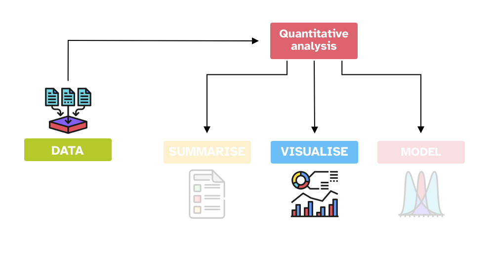

```{r setup, include=FALSE}
options(htmltools.dir.version = FALSE)
knitr::opts_chunk$set(
  fig.width=7, fig.height=5, fig.retina=3,
  out.width = "60%", fig.align = "center",
  cache = FALSE,
  echo = FALSE,
  message = FALSE, 
  warning = FALSE,
  hiline = TRUE
)
knitr::opts_knit$set(root.dir = here::here())

library(xaringanExtra)
use_xaringan_extra(c("panelset", "tachyons", "freezeframe"))

library(tidyverse)
theme_set(theme_light())
library(ggmosaic)

options(ggplot2.discrete.fill = RColorBrewer::brewer.pal(8, "Dark2"))
options(ggplot2.discrete.colour = RColorBrewer::brewer.pal(8, "Dark2"))
options(show.signif.stars = FALSE)
my_seed <- 8878
set.seed(my_seed)
```

```{r read-data}
glot_status <- readRDS("data/glot_status.rds")
formants <- read_csv("data/formants.csv")
gestures <- read_csv("data/gestures.csv")
polite <- read_csv("data/polite.csv")
mald_1_1 <- readRDS("data/mald_1_1.rds")

formants <- formants %>%
  mutate(
    time = time / 9
  ) %>%
  pivot_longer(f1:f2, names_to = "formant") %>%
  mutate(
    id = paste(file, formant, sep = "_")
  )
```


<iframe allowfullscreen frameborder="0" height="100%" mozallowfullscreen style="min-width: 500px; min-height: 355px" src="https://app.wooclap.com/events/SQQFXB/questions/651ac0766e9fba81222d2941" width="100%"></iframe>

---

## Data visualisation

.center[

]

---

## Good data visualisation

.bg-washed-blue.b--dark-blue.ba.bw2.br3.shadow-5.ph4.mt2[
Alberto Cairo has identified four common features of good data visualisation ([Spiegelhalter 2019](https://www.penguin.co.uk/books/294857/the-art-of-statistics-by-spiegelhalter-david/9780241258767):64-66):

1. It contains **reliable information**.

2. The design has been chosen so that relevant **patterns become noticeable**.

3. It is presented in an **attractive** manner, but appearance should not get in the way of **honesty, clarity and depth**.

4. When appropriate, it is organized in a way that **enables some exploration**.
]

---

layout: false

<iframe allowfullscreen frameborder="0" height="100%" mozallowfullscreen style="min-width: 500px; min-height: 355px" src="https://app.wooclap.com/events/SQQFXB/questions/650c1c85fc9e77ddc2cf39e6" width="100%"></iframe>

---

<iframe allowfullscreen frameborder="0" height="100%" mozallowfullscreen style="min-width: 500px; min-height: 355px" src="https://app.wooclap.com/events/SQQFXB/questions/650c1d1c6829de60e682066b" width="100%"></iframe>

---

## Endangerment status

```{r glot-status, echo=TRUE}
glot_status
```


---

## Bar chart

```{r status-bar}
glot_status %>%
  filter(status != "extinct") %>%
  ggplot(aes(status, fill = status)) +
  geom_bar() +
  scale_fill_brewer(type = "seq", palette = "BuPu")
```

???

Bar charts are great for counts (of anything).

The *x*-axis includes the level of status, while the *y*-axis shows the number of languages per status level.

---

layout: true

## Stacked bar chart

---

```{r status-stack-1}
glot_status %>%
  filter(status != "extinct") %>%
  mutate(
    endangered = ifelse(status == "not_endangered", "no", "yes")
  ) %>%
  ggplot(aes(endangered, fill = status)) +
  geom_bar() +
  scale_fill_brewer(type = "seq", palette = "BuPu")
```

???

In this plot I separated endangered vs non-endangered languages.
Within the endangered languages I further show the counts of different status levels.

---

```{r status-stack-2}
glot_status %>%
  filter(status != "extinct") %>%
  ggplot(aes(Macroarea, fill = status)) +
  geom_bar() +
  scale_fill_brewer(type = "seq", palette = "BuPu")
```

???

Here, the *x*-axis corresponds to the language macro-areas in the data.
Within each bar, the counts for each of the status levels is given.

---

layout: false

## Stacked proportion (filled) bar chart

```{r status-filled}
glot_status %>%
  filter(status != "extinct") %>%
  ggplot(aes(Macroarea, fill = status)) +
  geom_bar(position = "fill") +
  scale_fill_brewer(type = "seq", palette = "BuPu") +
  labs(y = "proportion")
```

???

So far we have seen raw counts.
What about proportions?

You can show proportions by using a "filled" bar chart.
Each bar is stretched so that covers the entire range from 0 to 1.

Note that proportions are between 0 and 1, while percentages are between 0 and 100%.

By default, `geom_bar()` adds a *y* label "counts" so you have to manually change the label to "proportions".

---

## Dot matrix chart

```{r status-matrix, fig.asp=1, out.width="45%"}
n_per_row <- 100
glot_status %>%
  filter(status != "extinct") %>%
  arrange(status) %>%
  mutate(
    x = rep(1:n_per_row, length.out = length(status)),
    y = rep(1:(ceiling(length(status) / n_per_row)), each = n_per_row)[1:length(status)]
  ) %>%
  ggplot(aes(x, -y, colour = status)) +
  geom_point(size = 1) +
  scale_color_brewer(type = "seq", palette = "PuRd") +
  theme(
    panel.grid = element_blank(),
    axis.title = element_blank(),
    axis.text = element_blank(),
    legend.position = "bottom"
  )
```


---

## Mosaic plot

```{r status-mosaic, warning=FALSE}
glot_status %>%
  filter(status != "extinct") %>%
  droplevels() %>%
  ggplot() +
  geom_mosaic(aes(product(Macroarea), fill = status)) +
  scale_fill_brewer(type = "seq", palette = "BuPu")
```

---

## Formant values

```{r formants, echo=TRUE}
formants
```

---

layout: true

## Line plot

---

```{r forms-line}
formants %>%
  filter(vowel == "o", c2 %in% c("t", "k")) %>%
  ggplot(aes(time, value, group = id, colour = formant)) +
  geom_line(alpha = 0.5) +
  facet_grid(. ~ c2) +
  labs(
    x = "Relative time", y = "Formant value (Hz)",
    title = "Formant trajectories of Italian /o/ followed by /k/ or /t/"
  )
```

---

```{r forms-point}
formants %>%
  filter(vowel == "o", c2 %in% c("t", "k")) %>%
  ggplot(aes(time, value, group = id, colour = formant)) +
  geom_point(alpha = 0.5) +
  facet_grid(. ~ c2) +
  labs(
    x = "Relative time", y = "Formant value (Hz)",
    title = "Formant trajectories of Italian /o/ followed by /k/ or /t/"
  )
```

---

```{r forms-line-point}
formants %>%
  filter(vowel == "o", c2 %in% c("t", "k")) %>%
  ggplot(aes(time, value, group = id, colour = formant)) +
  geom_line(alpha = 0.2) +
  geom_point(alpha = 0.5) +
  facet_grid(. ~ c2) +
  labs(
    x = "Relative time", y = "Formant value (Hz)",
    title = "Formant trajectories of Italian /o/ followed by /k/ or /t/"
  )
```

---

layout: false

## Infant gestures

```{r gestures, echo=TRUE}
gestures
```

---

layout: true

## More line plots

---

```{r gest-line}
gestures %>%
  ggplot(aes(as.factor(months), count)) +
  geom_line(aes(group = id), alpha = 0.2) +
  geom_point() +
  labs(
    title = "Infant gesture counts at 10, 11 and 12 mo",
    x = "Months old", y = "Gesture count"
  )
```


---

```{r gest-line-facet-1}
gestures %>%
  ggplot(aes(as.factor(months), count)) +
  geom_line(aes(group = id), alpha = 0.2) +
  geom_point() +
  facet_grid(~ gesture) +
  labs(
    title = "Infant gesture counts at 10, 11 and 12 mo, by gesture type",
    x = "Months old", y = "Gesture count"
  )
```

---

```{r gest-line-facet-2}
gestures %>%
  ggplot(aes(as.factor(months), count)) +
  geom_line(aes(group = id), alpha = 0.2) +
  geom_point() +
  facet_grid(background ~ gesture) +
  labs(
    title = "Infant gesture counts at 10, 11 and 12 mo",
    x = "Months old", y = "Gesture count"
  )
```

---

layout: false
layout: true

## Connected dots plot

---

```{r gest-conn-1}
gestures %>%
  filter(gesture != "ho_gv", count < 30) %>%
  group_by(dyad, months, gesture) %>%
  summarise(
    count_tot = sum(count)
  ) %>%
  ggplot(aes(gesture, count_tot)) +
  geom_line(aes(group = dyad), alpha = 0.2) +
  geom_point() +
  facet_grid(~ months) +
  labs(
    title = "Infant point vs reach counts at 10, 11 and 12 mo",
    x = "Gesture type", y = "Gesture count"
  )
```

---

```{r gest-conn-2}
gestures %>%
  filter(gesture != "ho_gv", count < 30) %>%
  group_by(dyad, background, months, gesture) %>%
  summarise(
    count_tot = sum(count)
  ) %>%
  ggplot(aes(gesture, count_tot), alpha = 0.2) +
  geom_line(aes(group = dyad)) +
  geom_point() +
  facet_grid(background ~ months) +
  labs(
    title = "Infant gesture counts at 10, 11 and 12 mo",
    x = "Gesture type", y = "Gesture count"
  )
```

---

layout: false

## Phonetics of politeness

```{r polite, echo=TRUE}
polite
```

---

layout: true

## Strip chart

---

```{r pol-strip-f0}
polite %>%
  ggplot(aes(attitude, f0mn, colour = gender)) +
  geom_jitter(width = 0.1, size = 2, alpha = 0.7) +
  facet_grid(~ gender)
```

---

```{r pol-strip-hnr}
polite %>%
  ggplot(aes(attitude, HNRmn, colour = gender)) +
  geom_jitter(width = 0.1, size = 2, alpha = 0.7) +
  facet_grid(~ gender)
```

---

layout: false
layout: true

## Density plot

---

```{r pol-dens-1}
polite %>%
  ggplot(aes(f0mn)) +
  geom_density() +
  geom_rug(alpha = 0.5)
```

---

```{r pol-dens-2}
polite %>%
  ggplot(aes(f0mn, fill = gender, colour = gender)) +
  geom_density(alpha = 0.5) +
  geom_rug(alpha = 0.5)
```

---

```{r pol-dens-3}
polite %>%
  ggplot(aes(f0mn, fill = attitude, colour = attitude)) +
  geom_density(alpha = 0.5) +
  geom_rug(alpha = 0.5) +
  facet_grid(~ gender)
```

---

```{r pol-dens-4}
polite %>%
  ggplot(aes(HNRmn, fill = attitude, colour = attitude)) +
  geom_density(alpha = 0.5) +
  geom_rug(alpha = 0.5) +
  facet_grid(~ gender)
```

---

layout: false
layout: true

## Violin plot

---

```{r pol-vio-1}
polite %>%
  ggplot(aes(attitude, HNRmn, fill = attitude, colour = attitude)) +
  geom_violin(alpha = 0.5) +
  facet_grid(~ gender)
```

---

```{r pol-vio-2}
polite %>%
  ggplot(aes(attitude, HNRmn, fill = attitude, colour = attitude)) +
  geom_violin(alpha = 0.5) +
  geom_point() +
  facet_grid(~ gender)
```

---

```{r pol-vio-3}
polite %>%
  ggplot(aes(attitude, HNRmn, fill = attitude, colour = attitude)) +
  geom_violin(alpha = 0.5) +
  geom_jitter(width = 0.1) +
  facet_grid(~ gender)
```

---

```{r pol-vio-4}
polite %>%
  ggplot(aes(attitude, HNRmn, colour = attitude)) +
  geom_violin(alpha = 0.5) +
  geom_jitter(width = 0.05) +
  geom_boxplot(width = 0.1) +
  facet_grid(~ gender)
```

---

layout: false
layout: true

## Scatter plot

---

```{r pol-sca-1}
polite %>%
  ggplot(aes(f0mn, H1H2)) +
  geom_point(alpha = 0.5)
```

---

```{r pol-sca-2}
polite %>%
  ggplot(aes(f0mn, H1H2)) +
  geom_point(alpha = 0.5) +
  geom_smooth(method = "lm")
```

---

```{r pol-sca-3}
polite %>%
  ggplot(aes(f0mn, H1H2)) +
  geom_point(alpha = 0.5) +
  facet_grid(~ gender)
```

---

```{r pol-sca-4}
polite %>%
  ggplot(aes(f0mn, H1H2)) +
  geom_point(alpha = 0.5) +
  facet_grid(~ gender) +
  geom_smooth(method = "lm")
```

---

```{r pol-sca-5}
polite %>%
  ggplot(aes(f0mn, H1H2, colour = attitude)) +
  geom_point(alpha = 0.5) +
  facet_grid(~ gender)
```

---

```{r mald-1}
mald_1_1 %>%
  filter(RT_log > 6) %>%
  ggplot(aes(PhonLev, RT/1000)) +
  geom_point(alpha = 0.5)
```


---

layout: false

class: center middle reverse

## DO'S AND DON'TS

---

layout: true

## DO

---

```{r mald-bar-1}
mald_1_1 %>%
  ggplot(aes(IsWord, fill = ACC)) +
  geom_bar(position = "dodge")
```

???

Bar charts should be used for discrete numeric variables, not for continuous variables.

---

```{r mald-bar-2}
mald_1_1 %>%
  ggplot(aes(IsWord, fill = ACC)) +
  geom_bar(position = "fill") +
  labs(y = "proportion")
```

???

If you want to show proportions, instead of raw counts, use proportion bar charts (aka filled bar chart).

---

```{r mald-bar-3}
mald_1_1 %>%
  count(Subject, IsWord, ACC) %>%
  group_by(Subject) %>%
  mutate(
    prop = n / sum(n)
  ) %>%
  ggplot(aes(IsWord, prop, colour = ACC)) +
  geom_jitter(position = position_jitterdodge(dodge.width = 1))
```

???

To show proportions from multiple subjects/items, use strip charts.

---

layout: false

## DON'T

```{r mald-dont}
mald_1_1 %>%
  count(Subject, IsWord, ACC) %>%
  group_by(Subject) %>%
  mutate(
    prop = n / sum(n)
  ) %>%
  group_by(IsWord, ACC) %>%
  summarise(
    mean_prop = mean(prop),
    sd_prop = sd(prop)
  ) %>%
  ggplot(aes(IsWord, mean_prop, fill = ACC)) +
  geom_bar(stat = "identity", position = "dodge") +
  geom_errorbar(aes(ymin = mean_prop - sd_prop, ymax = mean_prop + sd_prop), position = position_dodge(width = 0.9), width = 0.2)
```

???

Never ever ever use bar charts with error bars to show mean proportions. They are misleading:

- The bars do not indicate a discrete numeric values: mean proportions are continuous variables.
- Error bars mask the true variability of the data: show raw proportions instead.

For more see: https://www.data-to-viz.com/caveat/error_bar.html, https://stats.stackexchange.com/questions/349422/does-it-make-sense-to-add-error-bars-in-a-bar-chart-of-frequencies/367889#367889

---

## DO

```{r pol-do}
polite %>%
  ggplot(aes(attitude, HNRmn, fill = attitude, colour = attitude)) +
  geom_violin(alpha = 0.5) +
  geom_jitter(width = 0.1) +
  facet_grid(~ gender)
```

???

For continuous variables, like acoustic measures or reaction times, use violins with overlaid strip charts. You can include very narrow box plots, but remember that box plots mask variability in the raw data.

---

## DON'T

```{r pol-dont}
polite %>%
  ggplot(aes(attitude, HNRmn, fill = attitude, colour = attitude)) +
  geom_boxplot(alpha = 0.5) +
  facet_grid(~ gender)
```

???

Can you see what difference it makes to use box plots only?

---

## Summary

.bg-washed-blue.b--dark-blue.ba.bw2.br3.shadow-5.ph4.mt2[
- Carefully think about which type of variable you are working with: **continuous or discrete**?

- The type of variable allows you to select appropriate types of plots. Your **go-to plots** are:

  - Bar charts (and variants).
  - Strip charts.
  - Line plots.
  - Density plots.
  - Violin plots.

- Be mindful of the **DOs and DON'Ts** of plotting.
]
