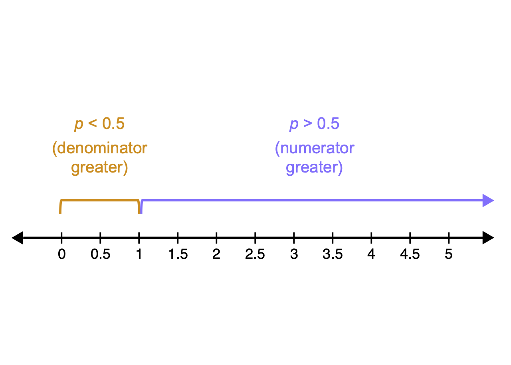
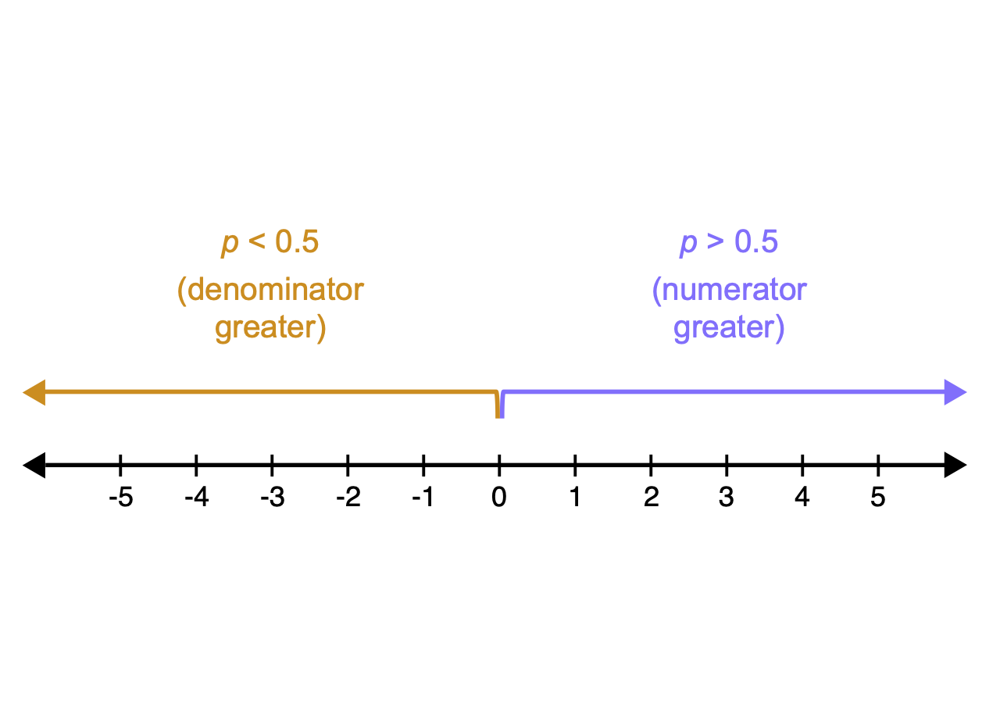

```{r setup, include=FALSE}
options(htmltools.dir.version = FALSE)
knitr::opts_chunk$set(
  fig.width=7, fig.height=5, fig.retina=3,
  out.width = "60%", fig.align = "center",
  cache = FALSE,
  echo = FALSE,
  message = FALSE, 
  warning = FALSE,
  hiline = TRUE
)
knitr::opts_knit$set(root.dir = here::here())

library(xaringanExtra)
use_xaringan_extra(c("panelset", "tachyons", "freezeframe"))

library(tidyverse)
theme_set(theme_light())
library(brms)
library(extraDistr)
library(ggdist)
library(glue)

options(ggplot2.discrete.fill = RColorBrewer::brewer.pal(8, "Dark2"))
options(ggplot2.discrete.colour = RColorBrewer::brewer.pal(8, "Dark2"))
options(show.signif.stars = FALSE)
my_seed <- 8878
```

```{r read-data}
shallow <- read_csv("data/shallow.csv") %>%
  filter(
    Group == "L1",
    Branching == "Left",
    Critical_Filler == "Critical",
    RT > 0
  ) %>%
  mutate(
    Accuracy = ifelse(ACC == 1, "correct", "incorrect"),
    Relation_type = factor(Relation_type, level = c("Unrelated", "NonConstituent", "Constituent")),
    Accuracy = factor(Accuracy, levels = c("incorrect", "correct"))
  )
```

## Summary from last week

.bg-washed-blue.b--dark-blue.ba.bw2.br3.shadow-5.ph4.mt2[
- **Comparing groups** with `brm()`

  - `outcome ~ predictor`.
  - Categorical predictor with 2 and 3 levels.

- **Treatment coding** of categorical predictors.

  - N–1 **dummy variables**, where N is number of levels in the predictor.
  - Level ordering is *alphabetical* but you can specify your own.
  - **NOTE**: You don't have to apply treatment coding yourself! It's done under the hood by R. But you should **understand how it works**.

- **Remember:**

  - The **Intercept** $\beta_0$ is the mean of the reference level.
  - The other $\beta$s are the **difference** of the other levels relative to the reference level.
]

---

## What are binary outcomes?

.bg-washed-blue.b--dark-blue.ba.bw2.br3.shadow-5.ph4.mt2[
**The variable you're trying to model has two levels**, e.g.: 

  - yes / no
  - grammatical / ungrammatical
  - Spanish / English
  - indirect object (*gave the girl the book*) / to-PP (*gave the book to the girl*)
  - correct / incorrect

Very common in linguistics!
]


---

layout: true

## Morphological processing

---

.bg-washed-blue.b--dark-blue.ba.bw2.br3.shadow-5.ph4.mt2[

- English L1 and L2 participants (L2 participants are native speakers of Cantonese).

- **Lexical decision task:** Is the word a real English word or not?

- Each trial:

  - **Prime**: *prolong* (unrelated), *unkind* (constituent), *kindness* (non-constituent).

  - **Target**: *unkindness* (*[un-kind]-ness*, not *un-[kind-ness]*).

- Data gathered: Reaction times and accuracy.
]

--

.bg-washed-green.b--dark-green.ba.bw2.br3.shadow-5.ph4.mt2[
We will focus on **accuracy** (correct identification of real word: **correct/incorrect**) for L1 participants.
]

---

```{r shal}
shallow %>%
  ggplot(aes(Relation_type, fill = Accuracy)) +
  geom_bar(position = "fill") +
  labs(
    title = "Proportion of correct vs incorrect responses",
    x = "Prime relation type",
    y = "Proportion"
  )
```

---

```{r shal-2}
shal_prop <- shallow %>%
  group_by(ID, Relation_type) %>%
  summarise(
    accuracy_prop = sum(ACC) / n()
  ) 

ggplot() +
  geom_jitter(data = shal_prop, aes(x = Relation_type, y = accuracy_prop), width = 0.1, alpha = 0.5) +
  stat_summary(data = shallow, aes(x = Relation_type, y = ACC, colour = Relation_type), fun.data = "mean_cl_boot", size = 1) +
  labs(
    title = "Proportion of correct vs incorrect responses by participant",
    caption = "Mean proportion is represented by coloured points with 95% bootstrapped Confidence Intervals.",
    x = "Prime relation type",
    y = "Proportion"
  ) +
  ylim(0, 1) +
  theme(legend.position = "none")
```

--


**Use this instead of bar charts with error bars!**


---

.bg-washed-blue.b--dark-blue.ba.bw2.br3.shadow-5.ph4.mt2[
We assume that there is **some probability $p$ of responding correctly.**

We don't know this probability, so we want to **use the data to estimate it.**
]

--

.bg-washed-green.b--dark-green.ba.bw2.br3.shadow-5.ph4.mt2[

Remember that probabilities are between 0 and 1.

Probabilities of a binary variable follow the **Bernoulli distribution**.

$$Bernoulli(p)$$

]

---

layout: false
layout: true

## Binary outcomes

---

.bg-washed-blue.b--dark-blue.ba.bw2.br3.shadow-5.ph4.mt2[
$$Bernoulli(p)$$

- A Bernoulli distribution generates a 1 ("success") with probability $p$.
- And a 0 ("failure") with probability $1 - p = q$.
  
And we can **think of our binary outcomes in terms of 0s and 1s:**

  - 0 = incorrect (or English, or no)
  - 1 = correct (or Scots, or yes)
]

--

.bg-washed-green.b--dark-green.ba.bw2.br3.shadow-5.ph4.mt2[
Examples:

- There is a 62% (= 0.62) probability that the response is correct. Which means there is a 38% (= 1 - 0.62 = 0.38) probability that the response is incorrect.

- There is a 89% (= 0.89) probability that the writer chooses an English spelling. Which means there is a 11% (= 1 - 0.89 = 0.11) probability that the writer chooses a Scots spelling.
]

---

.f3[
$$
\begin{aligned}
\text{acc} &\sim Bernoulli(p) \\
p &=\text{ ...}
\end{aligned}
$$
]

--

.bg-washed-green.b--dark-green.ba.bw2.br3.shadow-5.ph4.mt2[

- Accuracy $\text{acc}$ is a binary variable: incorrect vs. correct.

- $p$ is the probability of obtaining a "correct" response.

- **Our goal: estimate $p$.**
]

.bg-washed-yellow.b--gold.ba.bw2.br3.shadow-5.ph4.mt2[
But there's a problem...
]

---

.bg-washed-blue.b--dark-blue.ba.bw2.br3.shadow-5.ph4.mt2[

**Linear models can't estimate bounded data (probabilities) out of the box!**

- A straight line, in principle, goes on forever in am unbounded space.

- But probabilities are bounded between 0 and 1.

- This means we can't fit a straight line to probabilities directly.

]

--

.bg-washed-green.b--dark-green.ba.bw2.br3.shadow-5.ph4.mt2[

The solution: **transform the probabilities into something that is not bounded**.

]

.bg-washed-yellow.b--gold.ba.bw2.br3.shadow-5.ph4.mt2[
**NOTE**: What follows is for you how to understand how this works, but remember that this is done automatically by R for you so you never have to do it by hand!!!
]

---

.f3[
$$
\begin{aligned}
\text{acc} &\sim Bernoulli(p) \\
logit(p) &=\text{ ...}
\end{aligned}
$$
]

<br>

.bg-washed-blue.b--dark-blue.ba.bw2.br3.shadow-5.ph4.mt2[

- The **logit** (*log*istic un*it*) function converts probabilities to **log-odds**.

  - Log-odds are simply the log(arithm) of the odds.

- The model can work with log-odds because they are not bounded.

]

???

LO 4

<!-- .bg-washed-blue.b--dark-blue.ba.bw2.br3.shadow-5.ph4.mt2[ -->

<!-- - The **logistic** function converts log-odds to **probabilities**. -->

<!-- - The logistic function is the *inverse* of the logit function. -->

<!-- ] -->

---

layout: false
layout: true

## Odds and log-odds

---

.bg-washed-blue.b--dark-blue.ba.bw2.br3.shadow-5.ph4.mt2[

**What are odds**?

$$
\text{odds} = \frac{\text{probability of a thing happening}}{\text{probability of the thing not happening}} = \frac{p}{1-p}
$$
]

--

.bg-washed-green.b--dark-green.ba.bw2.br3.shadow-5.ph4.mt2[

If the probability of rain tomorrow is $p = 0.7$, then the odds of rain tomorrow are:

$$
\begin{aligned}
\text{odds}_{rain} &= \frac{p}{1-p} \\
&= \frac{0.7}{1-0.7} \\
&= \frac{0.7}{0.3} \\
&= 2.333...
\end{aligned}
$$
]

???

No longer bounded by 1, but are odds unbounded?

---

**Odds are still bounded (and also asymmetrical)**

.center[

]

---

We can log the odds to make them unbounded.

```{r logarithm, warning=FALSE}
ggplot() +
  xlim(0, 5) +
  ylim(-5, 2) +
  geom_function(fun = log, colour = "#8856a7", size = 1) +
  annotate("text", x = 2.5, y = -1, label = "log-odds = log(odds)", size = 8) +
  annotate("segment", x = 1, xend = 1, y = -5, yend = 0, linetype = "dashed") +
  annotate("segment", x = 0, xend = 1, y = 0, yend = 0, linetype = "dashed") +
  labs(
    x = "Odds", y = "Log-odds"
  )
```


---

**Log-odds are unbounded (and symmetrical)**

.center[

]

---

layout: false
layout: true

## Log-odds and probabilities

---

```{r p-log-odds}
dots <- tibble(
  p = seq(0.1, 0.9, by = 0.1),
  log_odds = qlogis(p)
)

p_log_odds <- tibble(
  p = seq(0, 1, by = 0.001),
  log_odds = qlogis(p)
) %>%
  ggplot(aes(log_odds, p)) +
  geom_hline(yintercept = 0.5, linetype = "dashed") +
  geom_hline(yintercept = 0, colour = "#8856a7", size = 1) +
  geom_hline(yintercept = 1, colour = "#8856a7", size = 1) +
  geom_vline(xintercept = 0, alpha = 0.5) +
  geom_line(size = 2) +
  # geom_point(data = dots, size = 4) +
  geom_point(x = 0, y = 0.5, colour = "#8856a7", size = 4) +
  annotate("text", x = -4, y = 0.8, label = "p = logit(log-odds)") +
  scale_x_continuous(breaks = seq(-6, 6, by = 1), minor_breaks = NULL, limits = c(-6, 6)) +
  scale_y_continuous(breaks = seq(0, 1, by = 0.1), minor_breaks = NULL) +
  labs(
    title = "Correspondence between log-odds and probabilities",
    x = "Log-odds",
    y = "Probability"
  )
p_log_odds
```

???

On logit vs logistic function: <https://stats.stackexchange.com/a/120364>.

---

Use `qlogis()` (*logit* function) to go from probabilities to log-odds.

```{r qlogis, echo=TRUE}
qlogis(0.3)
qlogis(0.5)
qlogis(0.7)
```

---

Use `plogis()` (*logistic* function, the inverse of the logit function) to go from log-odds to probabilities.

```{r plogis, echo=TRUE}
plogis(-1)
plogis(0)
plogis(1)
```

---

layout: false
layout: true

## Modelling accuracy

---

.f4[
$$
\begin{aligned}
\text{acc} & \sim Bernoulli(p) \\
logit(p)   & \sim Gaussian(\mu, \sigma) \\
\end{aligned}
$$
]


.bg-washed-yellow.b--gold.ba.bw2.br3.shadow-5.ph4.mt2[
- Because we are dealing with the outcome variable in the log-odds space, **all the parameters of the model are going to be estimated in log-odds.**
  - Here, this applies to $\mu$ and $\sigma$.
  
- We'll need to remember this when interpreting the model's estimates.
]

---

.bg-washed-blue.b--dark-blue.ba.bw2.br3.shadow-5.ph4.mt2[

**We need to pick a level of our outcome variable to be the "success"** (i.e. the `1` in the Bernoulli outcome).

- Let's choose `"correct"` as the success, so that we estimate $p$ as the probability of getting a "correct" response (or in other words the probability of responding correctly).

- To set this in out data, we can reorder the levels in `Accuracy` as `c("incorrect", "correct")`.

  - Note that the "success" level is the *second* level! This is different from the reference level business of categorical predictors, because now we are talking about *outcome variables*.
]

--

```{r acc-ord, echo=TRUE}
shallow <- shallow %>%
  mutate(
    Accuracy = factor(Accuracy, level = c("incorrect", "correct"))
  )

levels(shallow$Accuracy)
```

---

```{r acc-bm, echo=TRUE}
acc_bm <- brm(
  Accuracy ~ 1,
  family = bernoulli(),
  data = shallow,
  backend = "cmdstanr",
  file = "data/cache/acc_bm"
)
```

--

```{r acc-summ, echo=TRUE}
summary(acc_bm)
```


---

```{r acc-summ-2}
cat(capture.output(summary(acc_bm))[8:10], sep = "\n")
```


<br>

.f4[
$$
\begin{aligned}
\text{acc} & \sim Bernoulli(p) \\
logit(p) & \sim Gaussian(\mu = 1.32, \sigma = 0.11)
\end{aligned}
$$
]

<br>

- Parameter (`Intercept`): this is $logit(p)$.

- **Estimate**: $\mu = 1.32$ log-odds.

- **Est.Error**: $\sigma = 0.11$ log-odds.

---

layout: false

<iframe allowfullscreen frameborder="0" height="100%" mozallowfullscreen style="min-width: 500px; min-height: 355px" src="https://app.wooclap.com/events/SQQFXB/questions/65242dcc8f155ba53211f38e" width="100%"></iframe>

---

layout: true

## Modelling accuracy

---

```{r p-log-odds-2}
p_log_odds_2 <- tibble(
  p = seq(0, 1, by = 0.001),
  log_odds = qlogis(p)
) %>%
  ggplot(aes(log_odds, p)) +
  geom_hline(yintercept = 0.5, linetype = "dashed") +
  geom_hline(yintercept = 0, colour = "#8856a7", size = 1) +
  geom_hline(yintercept = 1, colour = "#8856a7", size = 1) +
  geom_vline(xintercept = 0, alpha = 0.5) +
  geom_line(size = 2) +
  annotate("segment", x = 1.32, xend = 1.32, y = 0, yend = plogis(1.32), colour = "#d95f02", linewidth = 1) +
  annotate("segment", x = -6, xend = 1.32, y = plogis(1.32), yend = plogis(1.32), colour = "#d95f02", linewidth = 1) +
  annotate("point", x = 1.32, y = plogis(1.32), colour = "#d95f02", size = 3) +
  annotate("text", x = 3, y = 0.1, label = "log-odds = 1.32") +
  annotate("text", x = -5, y = 0.9, label = "p = 0.79") +
  scale_x_continuous(breaks = seq(-6, 6, by = 1), minor_breaks = NULL, limits = c(-6, 6)) +
  scale_y_continuous(breaks = seq(0, 1, by = 0.1), minor_breaks = NULL) +
  labs(
    title = "Correspondence between log-odds and probabilities",
    x = "Log-odds",
    y = "Probability"
  )
p_log_odds_2
```


---

```{r acc-int}
acc_bm_draws <- as_draws_df(acc_bm)
int_dens_l <- density(acc_bm_draws$b_Intercept, adjust = 1.5)
int_dens <- tibble(
  x = int_dens_l$x,
  y = int_dens_l$y
)

ci_low <- 1.11
ci_hi <- 1.53
label_y <- 3.75

int_dens %>%
  ggplot(aes(x, y)) +
  geom_line(linewidth = 1) +
  scale_x_continuous(n.breaks = 6) +
  labs(
    title = expression(Probability~distribution~of~logit(p)),
    x = expression(logit(p)), y = "Probability density"
  ) +
  ylim(0, 4) +
  geom_ribbon(
    aes(x = ifelse(x >= ci_low & x <= ci_hi, x, NA), ymin = 0, ymax = y),
    fill = "#9970ab",
    alpha = 0.4
  ) +
  annotate(
    "segment",
    x = ci_low, xend = ci_hi, y = label_y, yend = label_y,
    arrow = arrow(ends = "both", angle = 90, length = unit(.2, "cm")),
    size = 1
  ) +
  annotate(
    "segment",
    x = ci_low, xend = ci_low, y = 0, yend = label_y,
    linetype = "dashed"
  ) +
  annotate(
    "segment",
    x = ci_hi, xend = ci_hi, y = 0, yend = label_y,
    linetype = "dashed"
  ) +
  annotate("label", x = ci_low + (ci_hi-ci_low)/2, y = label_y, label = "95% CrI")
```

There is a 95% probability that the log-odds of getting a "correct" response are between `r ci_low` and `r ci_hi`.

---

.bg-washed-green.b--dark-green.ba.bw2.br3.shadow-5.ph4.mt2[
It's easier to understand what that means if we convert log-odds to probabilities using the **logistic function** (which is the inverse of the logit function):

**There is a 95% probability that the probability of getting a "correct" response is between `r round(plogis(ci_low), 2)` and `r round(plogis(ci_hi), 2)`.**
]

```{r acc-int-prob, echo=TRUE}
round(plogis(1.11), 2)

round(plogis(1.53), 2)
```

---

layout: false

## Reporting

> We fitted a Bayesian linear model to accuracy with a Bernoulli distribution. According to the model, there is a 95% probability that the probability of getting a "correct" response is between `r round(plogis(ci_low), 2)` and `r round(plogis(ci_hi), 2)` (`\(\beta\)` = 1.32, SD = 0.11).

--

Note that it is easier to interpret probabilities than log-odds, so I recommend you report the probabilities in running text and the log-odds estimates between parentheses.

---

layout: false
layout: true

## Modelling accuracy by relation type

---

```{r rel-ord, echo=TRUE}
shallow <- shallow %>%
  mutate(
    Relation_type = factor(Relation_type, level = c("Unrelated", "NonConstituent", "Constituent"))
  )

levels(shallow$Relation_type)
```

<br>
<br>

|                            | NonConstituent | Constituent |
|----------------------------|----------------|---------------|
| Relation type = Unrelated       | 0              | 0             |
| Relation type = NonConstituent  | 1              | 0             |
| Relation type = Constituent     | 0              | 1             |

---

.f3[
$$
\begin{aligned}
\text{acc} & \sim Bernoulli(p) \\
logit(p) & = \beta_0 + \beta_1 \cdot relation_{ncons} + \beta_2 \cdot relation_{cons} \\
\beta_0 & \sim Gaussian(\mu_0, \sigma_0) \\
\beta_1 & \sim Gaussian(\mu_1, \sigma_1) \\
\beta_2 & \sim Gaussian(\mu_2, \sigma_2) \\
\end{aligned}
$$
]

```{r acc-bm-2, echo=TRUE}
acc_bm_2 <- brm(
  Accuracy ~ Relation_type,
  family = bernoulli(),
  data = shallow,
  backend = "cmdstanr",
  file = "data/cache/acc_bm_2"
)
```

---

```{r acc-bm-2-summ}
cat(capture.output(summary(acc_bm_2))[8:12], sep = "\n")
```


$$
\begin{aligned}
\text{acc} & \sim Bernoulli(p) \\
logit(p) & = \beta_0 + \beta_1 \cdot relation_{ncons} + \beta_2 \cdot relation_{cons} \\
\beta_0 & \sim Gaussian(1.02, 0.17) \\
\beta_1 & \sim Gaussian(\mu_1, \sigma_1) \\
\beta_2 & \sim Gaussian(\mu_2, \sigma_2) \\
\end{aligned}
$$
- Parameter `Intercept`: this is $\beta_0$ (the probability of a correct response when relation type is "unrelated").

- **Estimate**: $\mu = 1.02$ log-odds.

- **Est.Error**: $\sigma = 0.17$ log-odds.


---

```{r acc-bm-2-summ-1}
cat(capture.output(summary(acc_bm_2))[8:12], sep = "\n")
```


$$
\begin{aligned}
\text{acc} & \sim Bernoulli(p) \\
logit(p) & = \beta_0 + \beta_1 \cdot relation_{ncons} + \beta_2 \cdot relation_{cons} \\
\beta_0 & \sim Gaussian(1.02, 0.17) \\
\beta_1 & \sim Gaussian(\mu_1, \sigma_1) \\
\beta_2 & \sim Gaussian(\mu_2, \sigma_2) \\
\end{aligned}
$$


.bg-washed-green.b--dark-green.ba.bw2.br3.shadow-5.ph4.mt2[
**When relation type is `Unrelated`:**
- The mean log-odds of getting a correct response is 1.02 (which corresponds to a `r round(plogis(1.02), 2) * 100`% probability).

- Based on the CrIs, there is a 95% probability that the mean is between 0.71 and 1.36 log-odds (which corresponds to a probability between `r round(plogis(0.71), 2)` and `r round(plogis(1.36), 2)`).
]

---

```{r acc-bm-2-summ-2}
cat(capture.output(summary(acc_bm_2))[8:12], sep = "\n")
```

$$
\begin{aligned}
\text{acc} & \sim Bernoulli(p) \\
logit(p) & = \beta_0 + \beta_1 \cdot relation_{ncons} + \beta_2 \cdot relation_{cons} \\
\beta_0 & \sim Gaussian(1.02, 0.17) \\
\beta_1 & \sim Gaussian(0.19, 0.25) \\
\beta_2 & \sim Gaussian(\mu_2, \sigma_2) \\
\end{aligned}
$$

- **Effect of $relation_{ncons}$**: $\beta_1$ (the difference in log-odds between non-constituent and unrelated).

- **Estimate**: $\mu = 0.19$ log-odds.

- **Est.Error**: $\sigma = 0.25$ log-odds.

---

```{r acc-bm-2-summ-2a}
cat(capture.output(summary(acc_bm_2))[8:12], sep = "\n")
```

$$
\begin{aligned}
\text{acc} & \sim Bernoulli(p) \\
logit(p) & = \beta_0 + \beta_1 \cdot relation_{ncons} + \beta_2 \cdot relation_{cons} \\
\beta_0 & \sim Gaussian(1.02, 0.17) \\
\beta_1 & \sim Gaussian(0.19, 0.25) \\
\beta_2 & \sim Gaussian(\mu_2, \sigma_2) \\
\end{aligned}
$$

.bg-washed-green.b--dark-green.ba.bw2.br3.shadow-5.ph4.mt2[
**When the relation type is non-constituent**:

- The mean change in log-odds is 0.19.

- **You cannot convert this to probabilities!**

- We need to calculate the conditional probability of non-constituent.
]

---

```{r acc-bm-2-summ-3}
cat(capture.output(summary(acc_bm_2))[8:12], sep = "\n")
```


$$
\begin{aligned}
logit(p) &= \beta_0 + \beta_1 \cdot relation_{ncons} + \beta_2 \cdot relation_{cons} \\
&= 1.02 + (0.19 \cdot 1) + (\beta_2 \cdot 0) \\
&= 1.02 + 0.19\\
&= 1.21\\
p &= logistic(1.21)\\
 &= 0.77\\
\end{aligned}
$$
--

.bg-washed-green.b--dark-green.ba.bw2.br3.shadow-5.ph4.mt2[
**When the relation type is non-constituent**, the mean probability of responding correctly is 0.77.
]

--

```{r plog-1, echo = TRUE}
round(plogis(1.02 + 0.19), 2)
```

---

```{r acc-bm-2-draws}
acc_bm_2_draws <- as_draws_df(acc_bm_2) %>%
  mutate(
    Unrelated = b_Intercept,
    NonConstituent = b_Intercept + b_Relation_typeNonConstituent,
    Constituent = b_Intercept + b_Relation_typeConstituent
  ) %>%
  select(Unrelated:Constituent) %>%
  pivot_longer(Unrelated:Constituent, names_to = "Relation_type") %>%
  mutate(
    Relation_type = factor(Relation_type, level = c("Unrelated", "NonConstituent", "Constituent"))
  )
```

```{r acc-bm-2-cond}
acc_bm_2_draws %>%
  filter(Relation_type != "Constituent") %>%
  ggplot(aes(plogis(value), fill = Relation_type)) +
  geom_density(alpha = 0.5) +
  labs(
    title = "Conditional posterior probability of 'correct' response",
    x = "Probability", y = "Probability density"
  )
```

---

```{r acc-bm-2-summ-5}
cat(capture.output(summary(acc_bm_2))[8:12], sep = "\n")
```

<br>

```{r plog-3, echo=TRUE}
round(plogis(1.02 + 0.86), 2)
```

.bg-washed-green.b--dark-green.ba.bw2.br3.shadow-5.ph4.mt2[
**When the relation type is constituent**, there is on average an 87% probability of a "correct" response.
]

???

When the relation type is constituent, the mean change in log-odds is 0.86.

---

```{r acc-bm-2-cond-2}
acc_bm_2_draws %>%
  ggplot(aes(plogis(value), fill = Relation_type)) +
  geom_density(alpha = 0.5) +
  labs(
    title = "Conditional posterior probability of 'correct' response",
    x = "Probability", y = "Probability density"
  )
```

---

layout: false

## How do we find the 95% CrIs?

.bg-washed-blue.b--dark-blue.ba.bw2.br3.shadow-5.ph4.mt2[
**The empirical rule** (a.k.a., the 68–95–99.7 rule)
]

---

layout: false
layout: true

## The empirical rule

---

```{r empirical-rule-0, echo=FALSE}
x <- seq(-4, 4, by = 0.01)
y = dnorm(x, 0, 1)

ger_1 <- ggplot() +
  aes(x, y) +
  geom_line(size = 2, colour = "#FFA70B") +
  # scale_x_continuous(breaks = c(-4:4), labels = c("", expression(paste(-3, sigma)), expression(paste(-2, sigma)), expression(paste(-1, sigma)), expression(paste(mu)), expression(paste(+1, sigma)), expression(paste(+2, sigma)), expression(paste(+3, sigma)), "")) +
  ylim(0, 0.6) +
  labs(
    x = element_blank(), y = element_blank()
  ) +
  labs(
    title = "The Standard Gaussian distribution",
    subtitle = expression(paste(mu, "=", 0, ", ", sigma, "=", 1))
  )
ger_1
```

---

```{r empirical-rule-1, echo=FALSE}
x <- seq(-4, 4, by = 0.01)
y = dnorm(x, 0, 1)

ger_1 <- ggplot() +
  aes(x, y) +
  geom_line(size = 2, colour = "#FFA70B") +
  scale_x_continuous(breaks = c(-4:4), labels = c("", expression(paste(-3, sigma)), expression(paste(-2, sigma)), expression(paste(-1, sigma)), expression(paste(mu)), expression(paste(+1, sigma)), expression(paste(+2, sigma)), expression(paste(+3, sigma)), "")) +
  ylim(0, 0.6) +
  labs(
    x = element_blank(), y = element_blank()
  ) +
  labs(
    title = "The Standard Gaussian distribution",
    subtitle = expression(paste(mu, "=", 0, ", ", sigma, "=", 1))
  )
ger_1
```

---

```{r empirical-rule-2, echo=FALSE}
ger_1 +
  geom_ribbon(aes(x = ifelse(x >= -1 & x <= 1, x, NA), ymin = 0, ymax = y), alpha = 0.7, fill = "#8970FF") +
  annotate(
    "segment",
    x = -1, xend = 1, y = 0.45, yend = 0.45,
    arrow = arrow(ends = "both", angle = 90, length = unit(.2, "cm")),
    size = 1
  ) +
  annotate("label", x = 0, y = 0.45, label = "68%") +
  geom_line(size = 2, colour = "#FFA70B")
```

---

```{r empirical-rule-3, echo=FALSE}
ger_1 +
  geom_ribbon(aes(x = ifelse(x >= -2 & x <= 2, x, NA), ymin = 0, ymax = y), alpha = 0.4, fill = "#8970FF") +
annotate(
    "segment",
    x = -2, xend = 2, y = 0.5, yend = 0.5,
    arrow = arrow(ends = "both", angle = 90, length = unit(.2, "cm")),
    size = 1
  ) +
  annotate("label", x = 0, y = 0.50, label = "95%") +
  geom_line(size = 2, colour = "#FFA70B")
```


---

```{r empirical-rule-4, echo=FALSE}
ger_1 +
  geom_ribbon(aes(x = x, ymin = 0, ymax = y), alpha = 0.3, fill = "#8970FF") +
  annotate(
    "segment",
    x = -3, xend = 3, y = 0.55, yend = 0.55,
    arrow = arrow(ends = "both", angle = 90, length = unit(.2, "cm")),
    size = 1
  ) +
  annotate("label", x = 0, y = 0.55, label = "99.7 ≈ 100%") +
  geom_line(size = 2, colour = "#FFA70B")
```

---

```{r empirical-rule-5, echo=FALSE}
x <- seq(-4, 4, by = 0.01)
y = dnorm(x, 0, 1)
ggplot() +
  aes(x, y) +
  geom_ribbon(aes(x = x, ymin = 0, ymax = y), alpha = 0.3, fill = "#8970FF") +
  geom_ribbon(aes(x = ifelse(x >= -2 & x <= 2, x, NA), ymin = 0, ymax = y), alpha = 0.4, fill = "#8970FF") +
  geom_ribbon(aes(x = ifelse(x >= -1 & x <= 1, x, NA), ymin = 0, ymax = y), alpha = 0.7, fill = "#8970FF") +
  geom_line(size = 2, colour = "#FFA70B") +
  annotate(
    "segment",
    x = -1, xend = 1, y = 0.45, yend = 0.45,
    arrow = arrow(ends = "both", angle = 90, length = unit(.2, "cm")),
    size = 1
  ) +
  annotate("label", x = 0, y = 0.45, label = "68%") +
  annotate(
    "segment",
    x = -2, xend = 2, y = 0.5, yend = 0.5,
    arrow = arrow(ends = "both", angle = 90, length = unit(.2, "cm")),
    size = 1
  ) +
  annotate("label", x = 0, y = 0.50, label = "95%") +
  annotate(
    "segment",
    x = -3, xend = 3, y = 0.55, yend = 0.55,
    arrow = arrow(ends = "both", angle = 90, length = unit(.2, "cm")),
    size = 1
  ) +
  annotate("label", x = 0, y = 0.55, label = "99.7 ≈ 100%") +
  scale_x_continuous(breaks = c(-4:4), labels = c("", expression(paste(-3, sigma)), expression(paste(-2, sigma)), expression(paste(-1, sigma)), expression(paste(mu)), expression(paste(+1, sigma)), expression(paste(+2, sigma)), expression(paste(+3, sigma)), "")) +
  ylim(0, 0.6) +
  labs(
    x = element_blank(), y = element_blank(),
    title = "The Standard Gaussian distribution",
    subtitle = expression(paste(mu, "=", 0, ", ", sigma, "=", 1))
  )
```

???

As a general rule, $\pm2\sigma$ covers 95% of the Gaussian distribution, which means that there's a 95% probability that the value lies within that range.

---

layout: false
layout: true

## Computing CrIs using quantiles

---

.bg-washed-blue.b--dark-blue.ba.bw2.br3.shadow-5.ph4.mt2[
- **Quantiles** are cut points that divide a continuous probability distribution into intervals with equal probability.

- Common quantiles:

  - Quartiles (4 intervals, 25% of the data each).

  - Percentiles or centiles (100 intervals).
]

---

```{r quartiles, echo=FALSE}
x <- seq(-4, 4, by = 0.01)
y = dnorm(x, 0, 1)

quant_1 <- ggplot() +
  aes(x, y) +
  geom_line(size = 2, colour = "#FFA70B") +
  geom_vline(xintercept = qnorm(c(0.25, 0.5, 0.75)), linetype = "dashed") +
  annotate("label", x = qnorm(c(0.25, 0.5, 0.75)), y = 0.5, label = c("1st", "2nd", "3rd")) +
  ylim(0, 0.6) +
  labs(
    x = element_blank(), y = element_blank(),
    title = "The Standard Gaussian distribution",
    subtitle = expression(paste(mu, "=", 0, ", ", sigma, "=", 1))
  )
quant_1
```

---

```{r quart-1, echo=FALSE}
quant_1 +
  geom_ribbon(aes(x = ifelse(x < qnorm(0.25), x, NA), ymin = 0, ymax = y), alpha = 0.7, fill = "#8970FF") +
  geom_ribbon(aes(x = ifelse(x > qnorm(0.25), x, NA), ymin = 0, ymax = y), alpha = 0.2, fill = "#8970FF") +
  annotate("label", x = -1.25, y = 0.05, label = "25%") +
  annotate("label", x = 1.25, y = 0.05, label = "75%")
```

---

```{r quart-2, echo=FALSE}
quant_1 +
  geom_ribbon(aes(x = ifelse(x < qnorm(0.5), x, NA), ymin = 0, ymax = y), alpha = 0.7, fill = "#8970FF") +
  geom_ribbon(aes(x = ifelse(x > qnorm(0.5), x, NA), ymin = 0, ymax = y), alpha = 0.2, fill = "#8970FF") +
  annotate("label", x = -1.25, y = 0.05, label = "50%") +
  annotate("label", x = 1.25, y = 0.05, label = "50%")
```

---

```{r quart-3, echo=FALSE}
quant_1 +
  geom_ribbon(aes(x = ifelse(x < qnorm(0.75), x, NA), ymin = 0, ymax = y), alpha = 0.7, fill = "#8970FF") +
  geom_ribbon(aes(x = ifelse(x > qnorm(0.75), x, NA), ymin = 0, ymax = y), alpha = 0.2, fill = "#8970FF") +
  annotate("label", x = -1.25, y = 0.05, label = "75%") +
  annotate("label", x = 1.25, y = 0.05, label = "25%")
```

---

```{r centiles, echo=FALSE}
x <- seq(-4, 4, by = 0.01)
y = dnorm(x, 0, 1)

quant_1 <- ggplot() +
  aes(x, y) +
  geom_line(size = 2, colour = "#FFA70B") +
  geom_vline(xintercept = qnorm(c(0.02, 0.5, 0.98)), linetype = "dashed") +
  annotate("label", x = qnorm(c(0.02, 0.5, 0.98)), y = 0.5, label = c("2nd centile", "50th centile", "98th centile")) +
  ylim(0, 0.6) +
  labs(
    x = element_blank(), y = element_blank(),
    title = "The Standard Gaussian distribution",
    subtitle = expression(paste(mu, "=", 0, ", ", sigma, "=", 1))
  )
quant_1
```

---

```{r cent-96}
quant_1 +
  geom_ribbon(aes(x = ifelse(x >= qnorm(0.02) & x <= qnorm(0.98), x, NA), ymin = 0, ymax = y), alpha = 0.4, fill = "#8970FF") +
  annotate("label", x = 0, y = 0.05, label = "96%")
```

---

```{r cent-95}
quant_2 <- ggplot() +
  aes(x, y) +
  geom_line(size = 2, colour = "#FFA70B") +
  geom_vline(xintercept = qnorm(c(0.025, 0.975)), linetype = "dashed") +
  annotate("label", x = qnorm(c(0.025, 0.975)), y = 0.5, label = c("2.5 centile", "97.5 centile")) +
  ylim(0, 0.6) +
  labs(
    x = element_blank(), y = element_blank(),
    title = "The Standard Gaussian distribution",
    subtitle = expression(paste(mu, "=", 0, ", ", sigma, "=", 1))
  ) +
  geom_ribbon(aes(x = ifelse(x >= qnorm(0.025) & x <= qnorm(0.975), x, NA), ymin = 0, ymax = y), alpha = 0.4, fill = "#8970FF") +
   annotate("label", x = 0, y = 0.05, label = "95%")
quant_2
```

---

```{r cent-80}
quant_3 <- ggplot() +
  aes(x, y) +
  geom_line(size = 2, colour = "#FFA70B") +
  geom_vline(xintercept = qnorm(c(0.1, 0.9)), linetype = "dashed") +
  annotate("label", x = qnorm(c(0.1, 0.9)), y = 0.5, label = c("10th centile", "90th centile")) +
  ylim(0, 0.6) +
  labs(
    x = element_blank(), y = element_blank(),
    title = "The Standard Gaussian distribution",
    subtitle = expression(paste(mu, "=", 0, ", ", sigma, "=", 1))
  ) +
  geom_ribbon(aes(x = ifelse(x >= qnorm(0.1) & x <= qnorm(0.9), x, NA), ymin = 0, ymax = y), alpha = 0.4, fill = "#8970FF") +
  annotate("label", x = 0, y = 0.05, label = "80%")
quant_3
```

---

```{r cent-60}
quant_4 <- ggplot() +
  aes(x, y) +
  geom_line(size = 2, colour = "#FFA70B") +
  geom_vline(xintercept = qnorm(c(0.2, 0.8)), linetype = "dashed") +
  annotate("label", x = qnorm(c(0.2, 0.8)), y = 0.5, label = c("20th centile", "80th centile")) +
  ylim(0, 0.6) +
  labs(
    x = element_blank(), y = element_blank(),
    title = "The Standard Gaussian distribution",
    subtitle = expression(paste(mu, "=", 0, ", ", sigma, "=", 1))
  ) +
  geom_ribbon(aes(x = ifelse(x >= qnorm(0.2) & x <= qnorm(0.8), x, NA), ymin = 0, ymax = y), alpha = 0.4, fill = "#8970FF") +
  annotate("label", x = 0, y = 0.05, label = "60%")
quant_4
```

---

```{r acc-bm-2-draws-2, echo=TRUE}
acc_bm_2_draws
```

---

Calculate the **conditional posteriors** of the probability of a "correct" response in each relation type (as log-odds and probabilities).

```{r acc-bm-2-quant, echo=TRUE}
library(posterior)

# The 95% CrI
acc_bm_2_draws %>%
  group_by(Relation_type) %>%
  summarise(
    q95_lo = quantile2(value, probs = 0.025),  # the 2.5th centile
    q95_hi = quantile2(value, probs = 0.975),  # the 97.5th centile
    p_q95_lo = round(plogis(q95_lo), 2),
    p_q95_hi = round(plogis(q95_hi), 2)
  )
```

---

Calculate the **difference** between unrelated and non-constituent/constituent in **percent points**.

```{r acc-bm-2-quant-2, echo=TRUE}
as_draws_df(acc_bm_2) %>%
  mutate(
    NonConstituent_d = plogis(b_Intercept + b_Relation_typeNonConstituent) - plogis(b_Intercept),
    Constituent_d = plogis(b_Intercept + b_Relation_typeConstituent) - plogis(b_Intercept)
  ) %>%
  summarise(
    NC_p_95_lo = round(quantile2(NonConstituent_d, probs = 0.025), 2),
    NC_p_q95_hi = round(quantile2(NonConstituent_d, probs = 0.975), 2),
    C_p_95_lo = round(quantile2(Constituent_d, probs = 0.025), 2),
    C_p_q95_hi = round(quantile2(Constituent_d, probs = 0.975), 2)
  )
```


---

layout: false

## Reporting

> We fitted a Bayesian model to accuracy, with a Bernoulli distribution family and relation type (unrelated, non-constituent, constituent) as the only predictor. Relation type was coded using the default treatment contrasts with the unrelated level as the reference level.
>
> Based on the model, there is a 67-80% probability of a "correct" response when the relation type is unrelated, at 95% confidence (`\(\beta\)` = 1.02, SD = 0.17). When the type is non-constituent, the probability of a "correct" response is 70-83%; at 95% confidence, the difference between unrelated and non-constituent types is between -5 and +12 percent points (`\(\beta\)` = 0.19, SD = 0.25). When the type is constituent, the probability of a "correct" response is 81-91%; at 95% confidence, the difference between unrelated and non-constituent types is between +5 and +21 percent points (`\(\beta\)` = 0.86, SD = 0.29).
>
> While the results suggest a robust increase in the probability of a "correct" response in the constituent vs unrelated conditions, rangin from 5 to 21 percent points, the difference between non-constituent and unrelated is less certain with a range that includes both negative and positive values between -5 and +12 points. However, it can be noted that the interval leans more towards positive values than negative values, thus suggesting that if there is a difference it is probably positive although smaller than the difference between constituent and unrelated.
