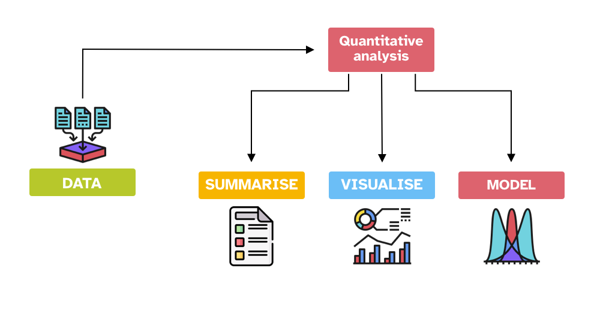

```{r setup, include=FALSE}
options(htmltools.dir.version = FALSE)
knitr::opts_chunk$set(
  fig.width=7, fig.height=5, fig.retina=3,
  out.width = "60%", fig.align = "center",
  cache = FALSE,
  echo = FALSE,
  message = FALSE, 
  warning = FALSE,
  hiline = TRUE
)
knitr::opts_knit$set(root.dir = here::here())

library(xaringanExtra)
use_xaringan_extra(c("panelset", "tachyons", "freezeframe"))

library(tidyverse)
theme_set(theme_light())
library(brms)
library(extraDistr)
library(ggdist)
library(glue)
library(posterior)

theme_update(text = element_text(size=14))

options(ggplot2.discrete.fill = RColorBrewer::brewer.pal(8, "Dark2"))
options(ggplot2.discrete.colour = RColorBrewer::brewer.pal(8, "Dark2"))
options(show.signif.stars = FALSE)
my_seed <- 8878

build <- function(){
  rmarkdown::render('slides/w09/index.Rmd')
}
```

class: center middle reverse

# Please fill out today's attendance form:

`https://forms.office.com/e/NC24KPHgRv`


<!-- .bg-washed-green.b--dark-green.ba.bw2.br3.shadow-5.ph4.mt2[ -->
<!-- We will focus on **accuracy** (correct identification of real word: **correct/incorrect**) for L1 participants. ]-->

---
layout: false
layout: true

## Summary from last time

---

.bg-washed-blue.b--dark-blue.ba.bw2.br3.shadow-5.ph4.mt2[
**(1)** What is a **factorial design?**
- A design with multiple categorical predictors in which data is gathered for **every combination** of those predictors' levels.
]

.bg-washed-blue.b--dark-blue.ba.bw2.br3.shadow-5.ph4.mt2[
**(2)** How do we estimate and interpret the effects of **multiple predictors?**
- A predictor's $\beta$ is the effect of that predictor *when the other predictor's value is 0*.
]

.bg-washed-blue.b--dark-blue.ba.bw2.br3.shadow-5.ph4.mt2[
**(3)** How do we deal with situations when **one predictor's effect is different, depending on the value of the other predictor?**
- We fit a model that contains an **interaction term** between those two predictors.
]

---

.bg-washed-blue.b--dark-blue.ba.bw2.br3.shadow-5.ph4.mt2[
**(4)** How can such interactions between predictors be **built into our models?**
- The interaction term is defined as the **product** of the two interacting predictors.
- It gets its own $\beta$ coefficient, which we estimate as usual.
]

.bg-washed-blue.b--dark-blue.ba.bw2.br3.shadow-5.ph4.mt2[
**(5)** How do we **interpret model estimates** of interactions? 
- The interaction term's $\beta$ tells us **how much one predictor's effect changes between the baseline and non-baseline levels of the other**.
- Interactions are symmetrical, and so they have two equivalent interpretations.
]

---
layout:false

## Three learning objectives for today

--

.bg-washed-blue.b--dark-blue.ba.bw2.br3.shadow-5.ph4.mt2[
**(1)** How do we model predictors that aren't categorical, but **continuous?**
]

--

.bg-washed-blue.b--dark-blue.ba.bw2.br3.shadow-5.ph4.mt2[
**(2)** How do we **interpret model estimates** for continuous predictors?
]

--

.bg-washed-blue.b--dark-blue.ba.bw2.br3.shadow-5.ph4.mt2[
**(3)** How do we fit and interpret **interactions involving continuous predictors?**
]

---

## Up to now: Categorical predictors, numerically coded

.bg-washed-blue.b--dark-blue.ba.bw2.br3.shadow-5.ph4.mt2[

Categorical predictors from earlier in the course:

- **`Modality`**, with levels `Taste` / `Smell`.

- **`Relation_type`**, with levels `Unrelated` / `Constituent` / `NonConstituent`.

- **`Branching`**, with levels `Left` / `Right`.

]

.bg-washed-blue.b--dark-blue.ba.bw2.br3.shadow-5.ph4.mt2[

**To make these predictors modellable,** we treatment-coded them using 0s and 1s.

]

--

.bg-washed-green.b--dark-green.ba.bw2.br3.shadow-5.ph4.mt2[

Good news: **Continuous variables are already numeric!**

]

???

But, consequence: interpreting the model's estimates is a little different.

---

## Examples of continuous predictors

.bg-washed-blue.b--dark-blue.ba.bw2.br3.shadow-5.ph4.mt2[

- **reaction time** in milliseconds

- **age** in years

- **speech rate** in syllables per second

]

---
layout: true

## How to interpret estimates from a continuous predictor?

---

--

### A little excursion into math from school...

--

<!-- Our linear expressions so far: -->

<!-- .f3[ -->
<!-- $$ y = \beta_0 + \beta_1 \cdot x  $$] -->

The basic equation for a line:

.f3[
$$
y = b + m\cdot x
$$
]

where

$$
\begin{aligned}
y: &~~~ \text{outcome variable} \\
b: &~~~ \text{intercept} \\
m: &~~~ \text{slope} \\
x: &~~~ \text{input variable} \\
\end{aligned}
$$
<br>

--

.bg-washed-blue.b--dark-blue.ba.bw2.br3.shadow-5.ph4.mt2[
Let's see an example: $y = 4 + 2x$.
]


---

```{r line-pos-slope}
palette <- RColorBrewer::brewer.pal(8, "Dark2")

(p_pos_slope <- tibble(
  x = 0:3,
  y = 2*x + 4
) %>% 
  ggplot(aes(x=x, y=y, group=1)) +
  geom_line(linewidth = 1.5) +
  theme(panel.grid.minor.x = element_blank()) +
    labs(
    title = 'y = 4 + 2x'
  ) +
  NULL)
```

---

```{r line-pos-slope2}
(p_pos_slope <- p_pos_slope +
   # intercept (should sound familiar)
  geom_text(x = 0.1, y = 4,
            label = 'The y-intercept is the value of y when x = 0.',
            colour = palette[1],
            hjust = 0,
            size = 5) +
  geom_point(x = 0, y = 4,
             colour = palette[1],
             size = 5) +
  NULL)
```

---

```{r line-pos-slope3}
(p_pos_slope <- p_pos_slope +
# one unit in x ("run")
  geom_segment(x = 1, xend = 2, y = 6, yend = 6, colour = palette[3],
               arrow = arrow(length = unit(0.3,"cm")),
               linewidth = 1) +
  geom_text(x = 1, y = 5.65,
            label = 'For a change of 1 in x...',
            colour = palette[3],
            hjust = 0,
            size = 5) +
  NULL)
```

---

```{r line-pos-slope4}
p_pos_slope + 
# corresp change in y ("rise")
  geom_segment(x = 2, xend = 2, y = 6, yend = 7.95, colour = palette[2],
               arrow = arrow(length = unit(0.3,"cm")),
               linewidth = 1) +
  geom_text(x = 2.05, y = 7, 
            label = '... the slope of the line\n is the change in y.',
            colour = palette[2],
            hjust = 0,
            size = 5) +
  NULL
```

---


```{r line-neg-slope}
(p_neg_slope <- tibble(
  x = 0:3,
  y = -2*x + 4
) %>% 
  ggplot(aes(x=x, y=y, group=1)) +
  geom_line(size = 1.5) +
  theme(panel.grid.minor.x = element_blank()) +
  labs(
    title = 'y = 4 + –2x'
  ) +
  NULL)
```

---

```{r line-neg-slope2}
(p_neg_slope <- p_neg_slope +
  # intercept (should sound familiar)
  geom_text(x = 0.1, y = 4,
            label = 'The y-intercept is the value of y when x = 0.',
            colour = palette[1],
            hjust = 0,
            size = 5) +
  geom_point(x = 0, y = 4,
             colour = palette[1],
             size = 5) +
  NULL)
```

---

```{r line-neg-slope3}
(p_neg_slope <- p_neg_slope +
# one unit in x ("run")
  geom_segment(x = 1, xend = 2, y = 2, yend = 2, colour = palette[3],
               arrow = arrow(length = unit(0.3,"cm")),
               size = 1) +
  geom_text(x = 1, y = 2.4, 
            label = 'For a change of 1 in x...', 
            colour = palette[3],
            hjust = 0,
            size = 5) +
  NULL)
```

---

```{r line-neg-slope4}
(p_neg_slope <- p_neg_slope +
# corresp change in y ("rise")
  geom_segment(x = 2, xend = 2, y = 2, yend = 0.05, colour = palette[2],
               size = 1,
               arrow = arrow(length = unit(0.3,"cm"))
               ) +
  geom_text(x = 2.05, y = 1, 
            label = '... a negative slope\nmeans y decreases.', 
            colour = palette[2],
            hjust = 0,
            size = 5) +
  NULL)
```


---
layout:false

## So what?

--

.bg-washed-blue.b--dark-blue.ba.bw2.br3.shadow-5.ph4.mt2[

Our linear models have the same form as the lines we saw in school.

$$
\begin{aligned}
y ~ &=& b ~~ &+& m &\cdot x \\ 
outcome ~ &=& intercept ~~ &+& slope &\cdot predictor \\
outcome ~ &=& \beta_0 ~~ &+& \beta_1 &\cdot predictor \\
\end{aligned}
$$
]

--

.bg-washed-green.b--dark-green.ba.bw2.br3.shadow-5.ph4.mt2[

$\beta_0$ corresponds to the line's $y$-intercept:

**The outcome value when the input value (i.e., the predictor) equals zero.**

]

--

.bg-washed-green.b--dark-green.ba.bw2.br3.shadow-5.ph4.mt2[

And $\beta_1$ has the same interpretation as $m$:

**The change in the outcome that results from a change of 1 (a.k.a., one unit change)<br> in the predictor.**

]

---

## Interpreting model estimates: A comparison

.pull-left[
.center[
.f4[
**0/1 treatment-coded predictors**
]
]
]

.pull-right[
.center[
.f4[
**Continuous predictors**
]
]
]

--

.pull-left[
.bg-washed-blue.b--dark-blue.ba.bw2.br3.shadow-5.ph4.mt2[
**Intercept ( $\beta_0$ ):**

- Estimated value of the outcome when predictor(s) equal to zero. 
  - i.e., **at predictor's baseline/reference level**.
]
]

--

.pull-right[
.bg-washed-blue.b--dark-blue.ba.bw2.br3.shadow-5.ph4.mt2[
**Intercept ( $\beta_0$ ):**

- Estimated value of the outcome when predictor(s) equal to zero. 
  - **on the predictor's scale**, e.g., <br> 0 ms, 0 lbs, 0 metres.
  <!-- - or if centered: 0 = the predictor's mean -->
]
]

--

.pull-left[
.bg-washed-blue.b--dark-blue.ba.bw2.br3.shadow-5.ph4.mt2[
**Effects (other $\beta$s):**

- Difference between estimated value of the outcome when predictor = 0 and when predictor = 1.
]
]

--

.pull-right[
.bg-washed-blue.b--dark-blue.ba.bw2.br3.shadow-5.ph4.mt2[
**Effects (other $\beta$s):**

- Difference between estimated value of the outcome **for one unit increase in predictor's value**.
]
]

---

## "Difference in outcome for one unit increase"?

--

$$
\beta_0 + \beta_1 \cdot var
$$

--
<br>

$$
\begin{aligned}
\text{var = 0 :}   & & \beta_0 &+ (\beta_1 \cdot 0) &&= \beta_0\\
\text{var = 1 :}   & & \beta_0 &+ (\beta_1 \cdot 1) &&= \beta_0 + \beta_1\\
\text{var = 2 :}   & & \beta_0 &+ (\beta_1 \cdot 2) &&= \beta_0 + 2\beta_1\\
\text{var = 3 :}   & & \beta_0 &+ (\beta_1 \cdot 3) &&= \beta_0 + 3\beta_1\\
\end{aligned}
$$
$$\vdots$$

--
<br>

.bg-washed-blue.b--dark-blue.ba.bw2.br3.shadow-5.ph4.mt2[

**Every time $var$ increases by one unit, the outcome increases by one $\beta_1$.** For example,

- if $var$ is distance in metres, then a unit is one metre.
- if $var$ is RT in milliseconds, then a unit is one millisecond.
- if $var$ is speech rate in syllables/second, then a unit is one syllable/second.
]

---

## Let's build a model predicting vowel duration<br> by speech rate (from `dur-ita-pol.csv`)

```{r read-data}
dur_ita_pol <- read_csv('data/dur-ita-pol.csv') %>% 
  mutate(
    log_v1_dur = log(v1_duration)
  )
```


--

.pull-left[

```{r dens-dur, out.width = "100%", fig.height = 5.5}
dur_ita_pol %>% 
  ggplot(aes(x= log_v1_dur)) +
  geom_density(fill = 'grey', alpha = 0.5) +
  geom_rug() +
  labs(x = 'Vowel duration (log ms)',
       title = 'Outcome: Log vowel duration')
```

]

.pull-right[

```{r dens-sr, out.width = "100%", fig.height = 5.5}
dur_ita_pol %>% 
  ggplot(aes(x= speech_rate)) +
  geom_density(fill = 'grey', alpha = 0.5) +
  geom_rug() +
  labs(x = 'Speech rate (syllables/sec)',
       title = 'Predictor: Speech rate')
```

]

---

## Log vowel duration ~ Speech rate

```{r scatter-dur-sr}
(p_dur_sr <- dur_ita_pol %>% 
   ggplot(aes(x = speech_rate, y = log_v1_dur)) +
   geom_point() +
   labs(
     x = 'Speech rate (syllables/sec)',
     y = 'Vowel duration (log ms)'
   ) +
   NULL)
```

???

Makes sense.
The faster you talk, the shorter your vowels are gonna be.

---

## The model we'll fit

<br><br>

.f3[
$$
\begin{aligned}
log(duration) &\sim Gaussian(\mu, \sigma)\\
\mu &= \beta_0 + \beta_1 \cdot speechrate \\
\beta_0 &\sim Gaussian(\mu_0, \sigma_0)\\
\beta_1 &\sim Gaussian(\mu_1, \sigma_1)\\
\sigma &\sim TruncGaussian(\mu_2, \sigma_2)
\end{aligned}
$$
]

---

```{r fit1, echo = TRUE}
dur_sr_bm <- brm(
  log_v1_dur ~ speech_rate,
  family = gaussian(),
  data = dur_ita_pol,
  backend = 'cmdstanr',
  file = 'data/cache/dur_sr_bm'
)
```


--

```{r fit1-summ, echo = TRUE}
summary(dur_sr_bm)
```


---

## Interpreting $\beta_0$ and $\beta_1$

```{r fit1-summ2}
cat(capture.output(summary(dur_sr_bm))[8:12], sep = "\n")
```

<br>

.bg-washed-blue.b--dark-blue.ba.bw2.br3.shadow-5.ph4.mt2[

**`Intercept`, a.k.a. $\beta_0$:**

- The mean log vowel duration when speech rate is equal to zero is 5.88 (95% CrI: [5.78, 5.99]).

**`speech_rate`, a.k.a. $\beta_1$:**

- For one unit change in speech rate, log vowel duration changes by –0.24 (95% CrI: [–0.26, –0.22]).

]

--


.bg-washed-blue.b--dark-blue.ba.bw2.br3.shadow-5.ph4.mt2[

**But ... what's a speech rate of zero?**

]

---

## A speech rate of zero is far outside the data observed

```{r scatter-dur-sr-vline}
p_dur_sr +
  geom_vline(xintercept = 0, 
             linewidth = 2,
             colour = 'red')
```

---

## To interpret the intercept more sensibly:<br> Centre `speech_rate`

.bg-washed-blue.b--dark-blue.ba.bw2.br3.shadow-5.ph4.mt2[

To centre a variable means to **transform it so that the mean of the centered version is zero.**
]

--

.bg-washed-blue.b--dark-blue.ba.bw2.br3.shadow-5.ph4.mt2[

How?
]

--

.bg-washed-green.b--dark-green.ba.bw2.br3.shadow-5.ph4.mt2[

**Subtract the variable's mean from every observation:**
]

```{r centre, echo = TRUE}
dur_ita_pol <- dur_ita_pol %>% 
  mutate(
    speech_rate_c = speech_rate - mean(speech_rate)
  )
```

---

## How does the centered version compare to the original?

.pull-left[

```{r scatter-dur-sr-2, out.width = "100%"}
p_dur_sr +
  labs(title = 'Speech rate is not centered')
```

```{r mean-noncentered, echo = TRUE}
round(mean(dur_ita_pol$speech_rate), 2)
```

]

.pull-right[

```{r scatter-dur-sr-3, out.width = "100%"}
dur_ita_pol %>% 
   ggplot(aes(x = speech_rate_c, y = log_v1_dur)) +
   geom_point() +
   labs(
     x = 'Centered speech rate (syllables/sec)',
     y = 'Vowel duration (log ms)',
     title = 'Speech rate is centered'
   ) +
   NULL
```

```{r mean-centered, echo = TRUE}
round(mean(dur_ita_pol$speech_rate_c))
```

]

???

So we predict we'll see the same slope estimate.
But a different intercept estimate, since now the place where the line intersects with x = 0 is different.

---

```{r fit2, echo = TRUE}
dur_sr_c_bm <- brm(
  log_v1_dur ~ speech_rate_c,
  family = gaussian(),
  data = dur_ita_pol,
  backend = 'cmdstanr',
  file = 'data/cache/dur_sr_c_bm'
)
```

--

```{r fit2-summ, echo = TRUE}
summary(dur_sr_c_bm)
```

---


## Interpreting the new $\beta_0$ and $\beta_1$ after centering

```{r fit2-summ2}
cat(capture.output(summary(dur_sr_c_bm))[8:12], sep = "\n")
```

--

.bg-washed-blue.b--dark-blue.ba.bw2.br3.shadow-5.ph4.mt2[

**`Intercept`, a.k.a. $\beta_0$:**

- When centered speech rate is equal to zero, **i.e., when speech rate is at its mean value,** <br> the mean log vowel duration is 4.59 (95% CrI: [4.58, 4.61]).

  - Before, uncentered: $\beta_0$ = 5.88 (95% CrI: [5.78, 5.99]).

**`speech_rate_c`, a.k.a. $\beta_1$**, is the same as before:

- For one unit change in speech rate, log vowel duration changes by –0.24 (95% CrI: [–0.26, –0.22]).

]

--

.bg-washed-green.b--dark-green.ba.bw2.br3.shadow-5.ph4.mt2[

**Centering continuous variables is pretty much always a good idea** to ease interpretation of the intercept.

]

???

Not going to show mathematical formulation of model with priors filled in—people can figure that out themselves. 

Also not going to do the conditional posterior probability distribs—doesn't fit narratively.

---
class: center middle reverse

# Part 2: Interactions <br> involving a continuous predictor

---
## Speech rate * Italian vowels "a" and "o" 

--

```{r dur-ita}
dur_ita <- dur_ita_pol %>% 
  filter(
    language == 'Italian',
    vowel %in% c('a', 'o')
  ) %>% 
  mutate(
    vowel = factor(vowel)
  )
```

.pull-left[

```{r dur-ita-public, echo = TRUE, eval = FALSE}
# Subset the data
dur_ita <- dur_ita_pol %>% 
  filter(
    language == 'Italian',
    vowel %in% c('a', 'o')
  )

# Create this plot --->
dur_ita %>% 
  ggplot(aes(x = speech_rate_c, 
             y = log_v1_dur, 
             colour = vowel, 
             fill = vowel)) +
  geom_point() +
  geom_smooth(method = 'lm') +
  labs(
    x = 'Centered speech rate (syll/sec)',
    y = 'Vowel duration (log ms)'
  )
```
]

.pull-right[
```{r dur-ita-plot, out.width = "100%", fig.height = 6}
(p_dur_ita <- dur_ita %>% 
  ggplot(aes(x = speech_rate_c, y = log_v1_dur, colour = vowel, fill = vowel)) +
  geom_point() +
  geom_smooth(method = 'lm') +
  labs(
    x = 'Centered speech rate (syll/sec)',
    y = 'Vowel duration (log ms)'
  ))
```
]

???

say out loud somewhere in here that "a" = 0, "o" = 1.

---

## The model we'll fit

<br><br>

.f4[
$$
\begin{aligned}
log(duration) &\sim Gaussian(\mu, \sigma)\\
\mu &= \beta_0 + (\beta_1 \cdot speechrate) + (\beta_2 \cdot vowel) + (\beta_3 \cdot speechrate \cdot vowel) \\
\beta_0 &\sim Gaussian(\mu_0, \sigma_0)\\
\beta_1 &\sim Gaussian(\mu_1, \sigma_1)\\
\beta_2 &\sim Gaussian(\mu_2, \sigma_2)\\
\beta_3 &\sim Gaussian(\mu_3, \sigma_3)\\
\sigma &\sim TruncGaussian(\mu_4, \sigma_4)
\end{aligned}
$$
]

---

```{r fit3, echo = TRUE}
dur_sr_vow_bm <- brm(
  log_v1_dur ~ speech_rate_c + vowel + speech_rate_c:vowel,
  family = gaussian(),
  data = dur_ita,
  backend = 'cmdstanr', file = 'data/cache/dur_sr_vow_bm'
)
```

--

```{r fit3-summ, echo = TRUE}
summary(dur_sr_vow_bm)
```


---

## How to report `Intercept` ( $\beta_0$ )

```{r fit3-summ2}
cat(capture.output(summary(dur_sr_vow_bm))[8:13], sep = "\n")
```

<br>
--

.bg-washed-blue.b--dark-blue.ba.bw2.br3.shadow-5.ph4.mt2[

**`Intercept`**, a.k.a. $\beta_0$:

- When centered speech rate is at its mean of zero and when the vowel is "a" (coded as zero), <br> the mean log vowel duration is 4.79 (95% CrI: [4.77, 4.81]).

]

---

## How to report `speech_rate_c` ( $\beta_1$ ), `vowelo` ( $\beta_2$ )

```{r fit3-summ3}
cat(capture.output(summary(dur_sr_vow_bm))[8:13], sep = "\n")
```

<br>
--

.bg-washed-blue.b--dark-blue.ba.bw2.br3.shadow-5.ph4.mt2[

**`speech_rate_c`**, a.k.a. $\beta_1$:

- When the vowel is "a" (coded as zero), when speech rate increases by one syllable/second, <br> the change in the mean log vowel duration is –0.26 (95% CrI: [–0.29, –0.24]).

]

--

.bg-washed-blue.b--dark-blue.ba.bw2.br3.shadow-5.ph4.mt2[

 **`vowelo`**, a.k.a. $\beta_2$:

- With centered speech rate at its mean of zero, when changing from the vowel "a" to the vowel "o", <br> the change in the mean log vowel duration is –0.04 (95% CrI: [–0.07, –0.01]).

]

---
layout: true

## How to report `speech_rate_c:vowelo` ( $\beta_3$ )

---

```{r fit3-summ4}
cat(capture.output(summary(dur_sr_vow_bm))[8:13], sep = "\n")
```
<br>
--

.bg-washed-blue.b--dark-blue.ba.bw2.br3.shadow-5.ph4.mt2[
**`speech_rate_c:vowelo`**, a.k.a. $\beta_3$, interpretation 1:

- When we move from the vowel "a" (baseline) to "o" (non-baseline), there is a positive adjustment <br> to the effect of speech rate of 0.04 (95% CrI [0, 0.07]).

]

.bg-washed-blue.b--dark-blue.ba.bw2.br3.shadow-5.ph4.mt2[
**`speech_rate_c:vowelo`**, a.k.a. $\beta_3$, interpretation 2:

- When we increase the speech rate by one syllable/second, there is a positive adjustment <br> to the effect of the vowel of 0.04 (95% CrI [0, 0.07]).
]

---

.pull-left[
```{r dur-ita-plot2, out.width="100%", fig.height=6}
p_dur_ita
```
]

--

.pull-right[

.bg-washed-blue.b--dark-blue.ba.bw2.br3.shadow-5.ph4.mt2[
**1: Positive adjustment to effect of speech rate when vowel "a" $\rightarrow$ "o"**
- The effect of `speech_rate_c` is negative, so a positive adjustment brings the effect closer to zero.
- **The slope (effect) when vowel = "o" is a bit weaker than for "a".**
]

.bg-washed-blue.b--dark-blue.ba.bw2.br3.shadow-5.ph4.mt2[
**2: Positive adjustment to effect of vowel when speech rate increases**
- The effect of `vowel` is negative, so a positive adjustment brings the effect closer to zero.
- **As speech rate increases, the difference (effect) between "a" and "o" decreases.**

]

]

---
layout: false
layout: true

## Conditional posterior probability distributions<br> of log vowel duration

---

--

.bg-washed-blue.b--dark-blue.ba.bw2.br3.shadow-5.ph4.mt2[

With continuous variables, we can **choose a few representative values** to compute conditional posterior distributions for. 
Here, we'll do:

  - $-1$: one syllable/second below mean
  - $0$: mean
  - $1$: one syllable/second above mean

]

<br>
--

$$
\begin{aligned}
\text{Speech rate = –1, vowel = “a”:}   && \beta_0 &+ (\beta_1 \cdot -1) + (\beta_2 \cdot 0) + (\beta_3 \cdot 0) &&= \beta_0 - \beta_1 &\\
\text{Speech rate = –1, vowel = “o”:}  && \beta_0 &+ (\beta_1 \cdot -1) + (\beta_2 \cdot 1) + (\beta_3 \cdot -1) &&= \beta_0 - \beta_1 + \beta_2 - \beta_3 &\\
\text{Speech rate = 0, vowel = “a”:}     && \beta_0 &+ (\beta_1 \cdot 0) + (\beta_2 \cdot 0) + (\beta_3 \cdot 0) &&= \beta_0  &\\
\text{Speech rate = 0, vowel = “o”:}    && \beta_0 &+ (\beta_1 \cdot 0) + (\beta_2 \cdot 1) + (\beta_3 \cdot 0) &&= \beta_0 + \beta_2 &\\
\text{Speech rate = 1, vowel = “a”:}   && \beta_0 &+ (\beta_1 \cdot 1) + (\beta_2 \cdot 0) + (\beta_3 \cdot 0) &&= \beta_0 + \beta_1 &\\
\text{Speech rate = 1, vowel = “o”:}  && \beta_0 &+ (\beta_1 \cdot 1) + (\beta_2 \cdot 1) + (\beta_3 \cdot 1) &&= \beta_0 + \beta_1 + \beta_2 + \beta_3 &\\
\end{aligned}
$$

???

worth saying again that these betas corresp to columns in the posterior draws 

---


```{r dur-draws}
dur_draws <- as_draws_df(dur_sr_vow_bm)

# Compute conditional probability distributions of logms
# for a few diff levels of speech rate
dur_draws_long <- dur_draws %>% 
  mutate(
    minus1_a = b_Intercept - b_speech_rate_c,
    minus1_o = b_Intercept - b_speech_rate_c + b_vowelo - `b_speech_rate_c:vowelo`,
    zero_a = b_Intercept,
    zero_o = b_Intercept + b_vowelo,
    plus1_a = b_Intercept + b_speech_rate_c,
    plus1_o = b_Intercept + b_speech_rate_c + b_vowelo + `b_speech_rate_c:vowelo`
  ) %>% 
  select(minus1_a:plus1_o) %>% 
  pivot_longer(everything(), names_to = 'pred_combo', values_to = 'logms_samples') %>% 
  separate(pred_combo, into = c('speech_rate_c', 'vowel')) %>% 
  mutate(
    speech_rate_c = case_when(
      speech_rate_c == 'minus1' ~ '–1',
      speech_rate_c == 'zero' ~ '0',
      speech_rate_c == 'plus1' ~ '1'
    )
  )
```

```{r dur-draws-dens, out.width="100%", fig.width = 10, fig.height = 4}
dur_draws_long %>% 
  ggplot(aes(x = logms_samples, fill = vowel)) +
  # ggplot(aes(x = exp(logms_samples), fill = vowel)) +
  geom_density(alpha = 0.5) +
  facet_wrap(~ speech_rate_c, nrow=1, labeller = labeller(speech_rate_c = label_both)) +
  labs(x = 'Vowel duration (log ms)')
```

---
layout: false

## Learning objectives revisited

--

.bg-washed-blue.b--dark-blue.ba.bw2.br3.shadow-5.ph4.mt2[
**(1)** How do we model predictors that aren't categorical, but **continuous?**

- They're already numeric, so strictly speaking, they *can* go into the model as-is.
- To interpret the intercept more easily, it's **usually good to centre them** by subtracting the mean.

]

--

.bg-washed-blue.b--dark-blue.ba.bw2.br3.shadow-5.ph4.mt2[
**(2)** How do we **interpret model estimates** for continuous predictors?

- In terms of **how much the outcome changes for one unit change** in the predictor.
- This general statement actually applies to treatment coding too: **0 $\rightarrow$ 1 is a unit change.**
]

--

.bg-washed-blue.b--dark-blue.ba.bw2.br3.shadow-5.ph4.mt2[
**(3)** How do we fit and interpret **interactions involving continuous predictors?**

- Pretty similarly to categorical predictors!
- To compute conditional posterior probability distributions, it's useful to **choose individual values<br> from the continuous predictor** to evaluate (e.g., the mean, mean + 1, mean – 1).
]

---
class: center middle reverse

## Statistics and Quantitative Methods: The Finale

Please fill out the **SATS-36 questionnaire** again (best done on a computer):

`https://forms.office.com/e/0UkDKTHWhp`


---

.center[

]

---

<br>

.center[

]

---
class: center middle reverse

# Stats can be hard.


### You don't have to know absolutely everything all the time.


It's OK to look up information as you need it.

It's OK to ask for help.


---

## Future avenues you're now ready to explore

**You can...**

--

.bg-washed-green.b--dark-green.ba.bw2.br3.shadow-5.ph4.mt2[

... take into account individual differences by **estimating slope and intercept adjustments** for, e.g., every participant in an experiment.
  - So-called **"random effects"** (the frequentist term) or **"group-level effects"** (the Bayesian term).

]

--

.bg-washed-green.b--dark-green.ba.bw2.br3.shadow-5.ph4.mt2[

... explore Bayesian hypothesis testing using **Bayes Factors.**

]

--

.bg-washed-green.b--dark-green.ba.bw2.br3.shadow-5.ph4.mt2[

... incorporate existing knowledge into your models by **setting your own priors**.

]

---
background-image: url(../../img/francesco-gallarotti-ruQHpukrN7c-unsplash.jpg)
background-size: cover


???

Photo by <a href="https://unsplash.com/@gallarotti?utm_source=unsplash&utm_medium=referral&utm_content=creditCopyText">Francesco Gallarotti</a> on <a href="https://unsplash.com/s/photos/new?utm_source=unsplash&utm_medium=referral&utm_content=creditCopyText">Unsplash</a>


- Rather than testing "significance" and thus making binary yes/no decisions about the existence of effects, we care about how big effects are.
- Bayesian models are a great tool for this: We lay out a range of possibilities (e.g., for a Bernoulli model, the probs of success), and use data to allocate different amounts of belief over the possibilities (i.e., to create the posterior probability distributions).
By using an approach based on estimating effect sizes and being explicit about uncertainty, you're on the cutting edge of modern statistical analysis

Even if you don't do Bayes down the road, many of the skills you've learned here are general and applicable to frequentist models as well.

