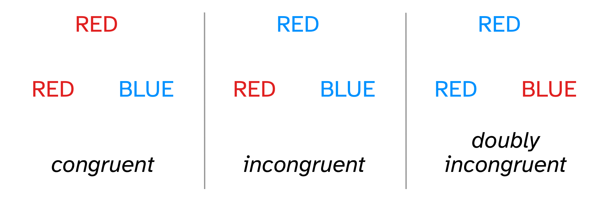

```{r setup, include=FALSE}
options(htmltools.dir.version = FALSE)
knitr::opts_chunk$set(
  fig.width=7, fig.height=5, fig.retina=3,
  out.width = "60%", fig.align = "center",
  cache = FALSE,
  echo = FALSE,
  message = FALSE, 
  warning = FALSE,
  hiline = TRUE
)
knitr::opts_knit$set(root.dir = here::here())

library(xaringanExtra)
use_xaringan_extra(c("panelset", "tachyons", "freezeframe"))

library(tidyverse)
theme_set(theme_light())
library(brms)
library(extraDistr)
library(ggdist)
library(glue)
library(posterior)

theme_update(text = element_text(size=14))

options(ggplot2.discrete.fill = RColorBrewer::brewer.pal(8, "Dark2"))
options(ggplot2.discrete.colour = RColorBrewer::brewer.pal(8, "Dark2"))
options(show.signif.stars = FALSE)
my_seed <- 8878
set.seed(my_seed)
```


---

## The Stroop effect

> The Stroop effect [is] a **slowing of reaction times when asked to name the color of a word that denotes a different color** (e.g., the word “red” written in green letters) as compared to when the color and denotation of a word are the same (e.g., the word “red” written in red letters), [and] reflects behavioral inhibition.

—From [Cannabinoids in Neurologic and Mental Disease, 2015](https://www.sciencedirect.com/science/article/pii/B978012417041400014X)

--

<br>

.pull-left[
.f1.center.red[RED]

.f1.center[*congruent*]
]

.pull-right[
.f1.center.blue[RED]

.f1.center[*incongruent*]
]

---

## "Double trouble" variant

<br>


.center[

]

---

## L1 vs L2 English speakers and language proficiency

.bg-washed-blue.b--dark-blue.ba.bw2.br3.shadow-5.ph4.mt2[
- **English L1 vs L2 speakers**

  - Does speaking English as your first or later-acquired language modulates the Stroop effect?
  
- **English language proficiency**

  - Does the level of English language proficiency modulates the Stroop effect?
]

--

.bg-washed-green.b--dark-green.ba.bw2.br3.shadow-5.ph4.mt2[
**ACTIVITY**

- **Form small groups** and discuss these questions based on your knowledge and/or reasoning.

- You will fill in a poll about your expectations.
]

---

class: middle center

<iframe width="853" height="480" src="https://vclock.com/embed/timer/#countdown=00:05:00&enabled=0&seconds=300&showmessage=0&theme=0&ampm=0&sound=xylophone" frameborder="0" allowfullscreen></iframe>

---

<iframe allowfullscreen frameborder="0" height="100%" mozallowfullscreen style="min-width: 500px; min-height: 355px" src="https://app.wooclap.com/events/SQQFXB/questions/6554f9e630f3da97e1e0db33" width="100%"></iframe>

???

Expectations poll 1

---

## Literature review

.bg-washed-green.b--dark-green.ba.bw2.br3.shadow-5.ph4.mt2[
**ACTIVITY**

- **Form small groups** and do a quick literature search on the Stroop effect and language acquisition.

- **Fill in the shared document** with what you find (link to be sent via Learn Announcement).
]

<br>

<div style="width:100%;height:0;padding-bottom:100%;position:relative;"><iframe src="https://giphy.com/embed/7Z71Z76pCC8Za" width="100%" height="25%" style="position:absolute" frameBorder="0" class="giphy-embed" allowFullScreen></iframe></div><p><a href="https://giphy.com/gifs/hamster-jar-seeds-7Z71Z76pCC8Za">via GIPHY</a></p>

---

class: middle center

<iframe width="853" height="480" src="https://vclock.com/embed/timer/#countdown=00:10:00&enabled=0&seconds=600&showmessage=0&theme=0&ampm=0&sound=xylophone" frameborder="0" allowfullscreen></iframe>

---

<iframe allowfullscreen frameborder="0" height="100%" mozallowfullscreen style="min-width: 500px; min-height: 355px" src="https://app.wooclap.com/events/SQQFXB/questions/6554f9ea30f3da97e1e0dc23" width="100%"></iframe>

???

Expectations poll 2

---

## Experimental design

.bg-washed-blue.b--dark-blue.ba.bw2.br3.shadow-5.ph4.mt2[
- **Congruency**: Congruent, Incongruent, Doubly incongruent trials.

  - 20 trials per congruency (60 trials per participant).

- **L1/L2**

- **Participants**

  - Students of QML.

  - 100?

- **6000 total observations** (2000 per congruency, divided by L1/L2).
]

---

## Factorial design

|    | Congruent | Incongruent | Doubly incongruent |
|----|:---------:|:-----------:|:------------------:|
| **L1** |    L1C    |     L1I     |         L1D        |
| **L2** |    L2C    |     L2I     |         L2D        |

<br>

.center[Language proficiency as a scale 0-100]

---

class: middle center inverse

.f1[RUN THE EXPERIMENT!]

---

class: middle center inverse

.f1[LIVE CODING]
